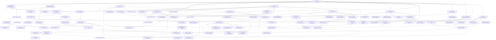

# ADR Dependency Map

```mermaid
graph TD;
    ADR-001[ADR-001: Core Architectural Style]
    ADR-002[ADR-002: Modular Monolith with Bounded Contexts]
    ADR-003[ADR-003: API-First Design]
    ADR-004[ADR-004: Domain Model and Provider Abstraction]
    ADR-005[ADR-005: Event-Driven Architecture]
    ADR-006[ADR-006: Bounded Contexts and Service Boundaries]
    ADR-007[ADR-007: Asynchronous-First Processing]
    ADR-008[ADR-008: Backend and Frontend Separation]
    ADR-009[ADR-009: Backend Language and Runtime]
    ADR-010[ADR-010: API Protocol]
    ADR-011[ADR-011: API Security and Versioning]
    ADR-012[ADR-012: Operational Database]
    ADR-013[ADR-013: Vector Storage]
    ADR-014[ADR-014: Knowledge Graph Storage]
    ADR-015[ADR-015: Caching, Conversation, and Session Store]
    ADR-016[ADR-016: Object Storage]
    ADR-017[ADR-017: Message Broker]
    ADR-018[ADR-018: Workflow Engine]
    ADR-019[ADR-019: Schema Migration and Data Governance]
    ADR-020[ADR-020: Multi-Model Persistence Strategy]
    ADR-021[ADR-021: Mission Workflow Processing]
    ADR-022[ADR-022: Event Streaming versus Event Sourcing]
    ADR-023[ADR-023: LLM Provider Abstraction]
    ADR-024[ADR-024: Model Routing and Fallback]
    ADR-025[ADR-025: Agent Orchestration Architecture]
    ADR-026[ADR-026: Memory and Context Management]
    ADR-027[ADR-027: Tool Registry]
    ADR-028[ADR-028: Structured Output and Parsing]
    ADR-029[ADR-029: Confidence Scoring and Hallucination Mitigation]
    ADR-030[ADR-030: Human-in-the-Loop and Approval]
    ADR-031[ADR-031: Agent Planning and Task Decomposition]
    ADR-032[ADR-032: Retrieval-Augmented Generation]
    ADR-033[ADR-033: Knowledge Graph Integration with RAG]
    ADR-034[ADR-034: Fine-Tuning versus Prompt Engineering]
    ADR-035[ADR-035: LLM Observability]
    ADR-036[ADR-036: Prompt Versioning and Management]
    ADR-037[ADR-037: Dynamics 365 CRM Adapter]
    ADR-038[ADR-038: Email and Calendar Adapter]
    ADR-039[ADR-039: Meeting Provider Adapter]
    ADR-040[ADR-040: External Research and Web Crawling]
    ADR-041[ADR-041: Provider Adapter Lifecycle]
    ADR-042[ADR-042: Integration Rate Limiting and Resilience]
    ADR-043[ADR-043: Integration Observability and Audit]
    ADR-044[ADR-044: User and Company Profile Model]
    ADR-045[ADR-045: Persona and Preference Learning]
    ADR-046[ADR-046: Recommendation and Next-Best-Action Engine]
    ADR-047[ADR-047: Sales Intelligence and Opportunity Scoring]
    ADR-048[ADR-048: Communication Personalization]
    ADR-049[ADR-049: Meeting Preparation and Briefing]
    ADR-050[ADR-050: Autonomous Action Execution]
    ADR-051[ADR-051: Feedback Loop and Continuous Improvement]
    ADR-052[ADR-052: Bias and Fairness Controls]
    ADR-053[ADR-053: Identity and Access Management]
    ADR-054[ADR-054: Multi-Tenancy Model]
    ADR-055[ADR-055: Tenant Isolation and Data Segregation]
    ADR-056[ADR-056: Tenant-Scoped Roles and Permissions]
    ADR-057[ADR-057: Secret and Credential Management]
    ADR-058[ADR-058: Data Encryption at Rest and In Transit]
    ADR-059[ADR-059: Audit Logging and Non-Repudiation]
    ADR-060[ADR-060: API Rate Limiting and Abuse Prevention]
    ADR-061[ADR-061: Vulnerability and Dependency Management]
    ADR-062[ADR-062: AI Safety and Output Filtering]
    ADR-063[ADR-063: Prompt Injection Defenses]
    ADR-064[ADR-064: Data Residency and Region Strategy]
    ADR-065[ADR-065: Backup, Disaster Recovery, and Retention]
    ADR-066[ADR-066: Compliance Framework Alignment]
    ADR-067[ADR-067: Privacy and Consent Management]
    ADR-068[ADR-068: Penetration Testing and Red Teaming]
    ADR-069[ADR-069: Incident Response and Security Operations]
    ADR-070[ADR-070: Tenant Offboarding and Data Destruction]
    ADR-071[ADR-071: Container and Packaging]
    ADR-072[ADR-072: Orchestration and Deployment Target]
    ADR-073[ADR-073: Infrastructure as Code]
    ADR-074[ADR-074: Cloud Provider and Region Strategy]
    ADR-075[ADR-075: CI/CD and Release Pipelines]
    ADR-076[ADR-076: Environment Strategy]
    ADR-077[ADR-077: Observability Stack]
    ADR-078[ADR-078: Secrets and Configuration Distribution]
    ADR-079[ADR-079: Cost and Capacity Management]
    ADR-080[ADR-080: Automated Testing Strategy]
    ADR-081[ADR-081: Contract and API Testing]
    ADR-082[ADR-082: AI and Agent Evaluation Framework]
    ADR-083[ADR-083: End-to-End and UI Testing]
    ADR-084[ADR-084: Security and Adversarial Testing]
    ADR-085[ADR-085: ADR Governance Process]
    ADR-086[ADR-086: API and Schema Governance]
    ADR-087[ADR-087: Code and Repository Governance]
    ADR-088[ADR-088: AI Model and Prompt Governance]
    ADR-089[ADR-089: Release and Versioning Governance]
    ADR-090[ADR-090: Observability and SLO Governance]
    ADR-091[ADR-091: Security and Compliance Governance]
    ADR-092[ADR-092: Documentation and Runbook Governance]
    ADR-093[ADR-093: Third-Party and Vendor Governance]
    ADR-094[ADR-094: Lifecycle and Deprecation Governance]
    ADR-095[ADR-095: Release Strategy]
    ADR-001 --> ADR-002
    ADR-001 --> ADR-003
    ADR-001 --> ADR-004
    ADR-001 --> ADR-005
    ADR-001 --> ADR-006
    ADR-002 --> ADR-006
    ADR-001 --> ADR-007
    ADR-005 --> ADR-007
    ADR-003 --> ADR-008
    ADR-001 --> ADR-009
    ADR-002 --> ADR-009
    ADR-003 --> ADR-010
    ADR-010 --> ADR-011
    ADR-001 --> ADR-012
    ADR-012 --> ADR-013
    ADR-012 --> ADR-014
    ADR-012 --> ADR-015
    ADR-012 --> ADR-016
    ADR-015 --> ADR-017
    ADR-017 --> ADR-018
    ADR-012 --> ADR-019
    ADR-012 --> ADR-020
    ADR-013 --> ADR-020
    ADR-014 --> ADR-020
    ADR-015 --> ADR-020
    ADR-016 --> ADR-020
    ADR-005 --> ADR-021
    ADR-017 --> ADR-021
    ADR-018 --> ADR-021
    ADR-005 --> ADR-022
    ADR-001 --> ADR-023
    ADR-023 --> ADR-024
    ADR-001 --> ADR-025
    ADR-005 --> ADR-025
    ADR-015 --> ADR-026
    ADR-012 --> ADR-026
    ADR-025 --> ADR-027
    ADR-027 --> ADR-028
    ADR-028 --> ADR-029
    ADR-029 --> ADR-030
    ADR-025 --> ADR-031
    ADR-013 --> ADR-032
    ADR-023 --> ADR-032
    ADR-014 --> ADR-033
    ADR-032 --> ADR-033
    ADR-023 --> ADR-034
    ADR-001 --> ADR-035
    ADR-023 --> ADR-035
    ADR-023 --> ADR-036
    ADR-034 --> ADR-036
    ADR-004 --> ADR-037
    ADR-004 --> ADR-038
    ADR-004 --> ADR-039
    ADR-001 --> ADR-040
    ADR-032 --> ADR-040
    ADR-004 --> ADR-041
    ADR-037 --> ADR-041
    ADR-041 --> ADR-042
    ADR-042 --> ADR-043
    ADR-012 --> ADR-044
    ADR-015 --> ADR-044
    ADR-044 --> ADR-045
    ADR-044 --> ADR-046
    ADR-045 --> ADR-046
    ADR-044 --> ADR-047
    ADR-046 --> ADR-047
    ADR-045 --> ADR-048
    ADR-030 --> ADR-048
    ADR-032 --> ADR-049
    ADR-038 --> ADR-049
    ADR-040 --> ADR-049
    ADR-030 --> ADR-050
    ADR-027 --> ADR-050
    ADR-045 --> ADR-051
    ADR-046 --> ADR-051
    ADR-045 --> ADR-052
    ADR-001 --> ADR-053
    ADR-012 --> ADR-054
    ADR-054 --> ADR-055
    ADR-053 --> ADR-056
    ADR-054 --> ADR-056
    ADR-053 --> ADR-057
    ADR-057 --> ADR-058
    ADR-054 --> ADR-059
    ADR-015 --> ADR-060
    ADR-011 --> ADR-060
    ADR-001 --> ADR-061
    ADR-023 --> ADR-062
    ADR-062 --> ADR-063
    ADR-054 --> ADR-064
    ADR-012 --> ADR-065
    ADR-016 --> ADR-065
    ADR-054 --> ADR-066
    ADR-059 --> ADR-066
    ADR-054 --> ADR-067
    ADR-061 --> ADR-068
    ADR-062 --> ADR-068
    ADR-059 --> ADR-069
    ADR-061 --> ADR-069
    ADR-054 --> ADR-070
    ADR-065 --> ADR-070
    ADR-009 --> ADR-071
    ADR-071 --> ADR-072
    ADR-072 --> ADR-073
    ADR-064 --> ADR-074
    ADR-073 --> ADR-075
    ADR-075 --> ADR-076
    ADR-001 --> ADR-077
    ADR-035 --> ADR-077
    ADR-057 --> ADR-078
    ADR-073 --> ADR-078
    ADR-074 --> ADR-079
    ADR-009 --> ADR-080
    ADR-010 --> ADR-081
    ADR-080 --> ADR-081
    ADR-025 --> ADR-082
    ADR-029 --> ADR-082
    ADR-080 --> ADR-082
    ADR-008 --> ADR-083
    ADR-080 --> ADR-083
    ADR-061 --> ADR-084
    ADR-080 --> ADR-084
    ADR-082 --> ADR-084
    ADR-001 --> ADR-085
    ADR-003 --> ADR-086
    ADR-085 --> ADR-086
    ADR-085 --> ADR-087
    ADR-085 --> ADR-088
    ADR-035 --> ADR-088
    ADR-086 --> ADR-089
    ADR-077 --> ADR-090
    ADR-085 --> ADR-090
    ADR-085 --> ADR-091
    ADR-066 --> ADR-091
    ADR-085 --> ADR-092
    ADR-023 --> ADR-093
    ADR-041 --> ADR-093
    ADR-085 --> ADR-093
    ADR-089 --> ADR-094
    ADR-075 --> ADR-095
    ADR-089 --> ADR-095
```