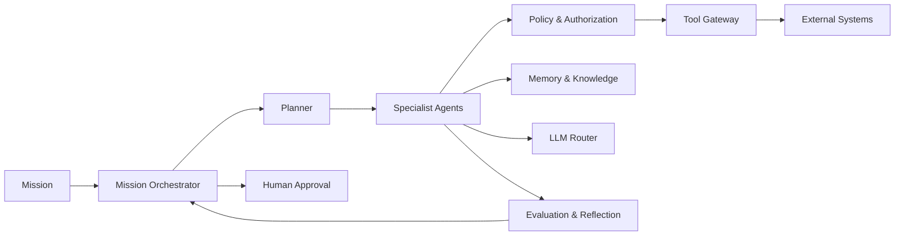

# AI-Native Architecture

## AI-Native Principle

The system is not "traditional SaaS + LLM." AI is a first-class execution, reasoning, and decision-making capability operating within explicit authority, policy, security, compliance, tenant, and business boundaries.

## Cognitive Loop

The AI architecture supports a continuous loop:

```
PERCEIVE → UNDERSTAND → REASON → PLAN → ACT → OBSERVE → EVALUATE → REFLECT → ADAPT → CONTINUE
```

Each step is observable, auditable, and bounded.

## Key Boundaries

| Boundary | Meaning |
|---|---|
| Authority | What the AI is permitted to do |
| Policy | Rules that constrain action |
| Security | Authentication, authorization, threat mitigation |
| Compliance | Legal/regulatory constraints |
| Tenant | Isolation of customer data and actions |
| Business | Commercial objectives and risk tolerance |

## Architecture Overview

- **AI Control Plane**: governs agents, policies, approvals, autonomy, registries, and emergency controls.
- **AI Execution Plane**: runs agents, assembles context, retrieves memory/knowledge, routes LLMs, executes tools, validates outputs.
- **Mission Orchestrator**: coordinates long-running revenue missions without becoming a god-object.
- **Planner**: creates and revises plans based on mission goals and observations.
- **Specialist Agents**: narrow, capability-bounded agents for research, qualification, outreach, conversation, meetings, CRM.
- **Policy & Authorization Layer**: evaluates every action before execution.
- **Tool Gateway**: executes approved tools with full audit and validation.
- **Human-in-the-Loop**: approval, override, and escalation path.
- **Evaluation & Reflection**: continuous assessment of AI outputs and actions.

## Design Tenets

1. AI does not bypass policy or authorization.
2. Memory and knowledge do not equal authority.
3. Every important decision requires evidence and confidence.
4. Planning is separate from execution.
5. Tools are gated, versioned, and audited.
6. Failures are assumed and contained.
7. Tenant isolation is enforced end-to-end.
8. Human approval is a first-class architectural mechanism.

## AI-Native Architecture Diagram


