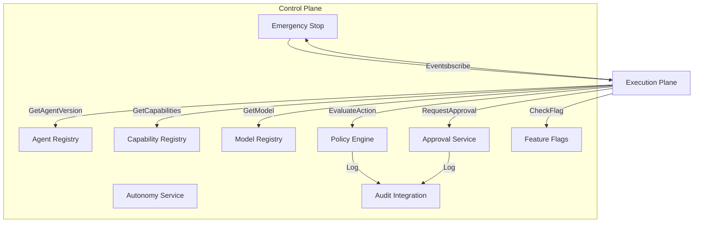

# AI Control Plane

## Purpose

The AI Control Plane governs every AI capability. It owns agent definitions, policies, autonomy levels, approvals, registries, feature flags, and emergency controls. The Execution Plane must consult the Control Plane but cannot modify it.

## Responsibilities

| Component | Ownership |
|---|---|
| Agent Registry | Agent identity, roles, versions, capabilities, lifecycle state |
| Capability Registry | What each capability permits, required tools, risk class |
| Model Registry | Supported models, providers, capabilities, cost/latency metadata |
| Policy Engine | Policy evaluation against action context |
| Autonomy Service | Maps autonomy level and risk to ALLOW / REQUIRE_APPROVAL / DENY |
| Approval Service | Approval request lifecycle, escalation, timeout |
| Feature Flag Service | Rollout controls for agents, models, tools, autonomy levels |
| Emergency Stop | Tenant/mission/agent suspension and kill switches |
| Audit Integration | Records all governance decisions |

## Control Plane Interfaces

- `EvaluateAction(actionContext) → PolicyDecision`
- `RegisterAgent(agentDefinition)`
- `PublishAgentVersion(agentId, version)`
- `RequestApproval(approvalContext) → approvalId`
- `GetApprovalDecision(approvalId) → APPROVED / REJECTED / PENDING`
- `SuspendAgent(agentId / tenantId / missionId)`
- `ListCapabilities(agentId, tenantId)`
- `GetModelRecommendation(taskContext) → modelId`

## Policy Hierarchy

1. System Policy (platform-wide minimums)
2. Tenant Policy (customer configuration)
3. Mission Policy (mission-specific rules)
4. Agent Policy (agent-specific constraints)
5. Action Policy (fine-grained action rules)

Lower-numbered policies take precedence when conflict resolution is required.

## Control Plane Security

- Separate trust boundary from Execution Plane.
- Strong authentication for all governance APIs.
- Immutable published policies; updates create new versions.
- Tenant-scoped queries; no cross-tenant policy leakage.
- Emergency stop propagated via events with low latency.

## Control Plane Diagram

