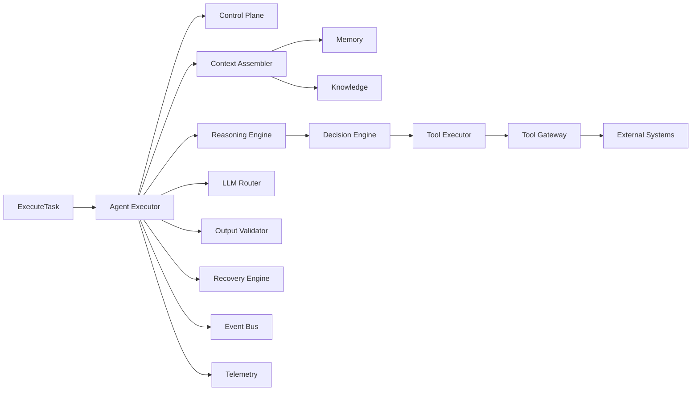

# AI Execution Plane

## Purpose

The AI Execution Plane runs agent tasks under the authority of the Control Plane. It assembles context, retrieves memory and knowledge, routes to LLMs, executes tools, validates outputs, emits events, and reports telemetry.

## Components

| Component | Responsibility |
|---|---|
| Agent Executor | Loads agent version and runs tasks |
| Mission Orchestrator | Coordinates mission state and delegates tasks |
| Planner | Produces and revises plans |
| Specialist Agents | Execute narrow, capability-bounded tasks |
| Context Assembler | Builds prompt and execution context |
| Reasoning Engine | Produces structured reasoning and decision rationale |
| Decision Engine | Selects actions based on reasoning and policy |
| Tool Executor | Executes approved tools via Tool Gateway |
| LLM Router | Selects model/provider and routes requests |
| Output Validator | Validates structure, citations, policy compliance |
| Action Validator | Confirms action is authorized before execution |
| Memory Retriever | Retrieves relevant memory |
| Knowledge Retriever | Retrieves relevant knowledge |
| Telemetry Collector | Records tokens, latency, cost, outcomes |
| Event Publisher | Emits execution lifecycle events |
| Recovery Engine | Handles failures, retries, fallback, compensation |

## Execution Flow

1. Receive `ExecuteTask` command with tenant, mission, agent, and task context.
2. Load agent version and capabilities from Control Plane.
3. Evaluate action/policy through Control Plane.
4. If approval required, suspend and create approval task.
5. Assemble context, memory, knowledge.
6. Route to LLM via LLM Router.
7. Parse reasoning, decisions, and tool requests.
8. Validate tool authorization and inputs.
9. Execute tools through Tool Gateway.
10. Validate outputs.
11. Record outcome, evidence, telemetry.
12. Emit `AgentExecutionCompleted` / `AgentExecutionFailed` / `AgentExecutionAwaitingApproval`.

## Execution Plane Principles

- Never bypass Control Plane.
- Every external action passes through Tool Gateway.
- Context is tenant-scoped and token-budgeted.
- Outputs are validated before use.
- Failures are captured and recovered.
- All execution steps are observable.

## Execution Plane Diagram

