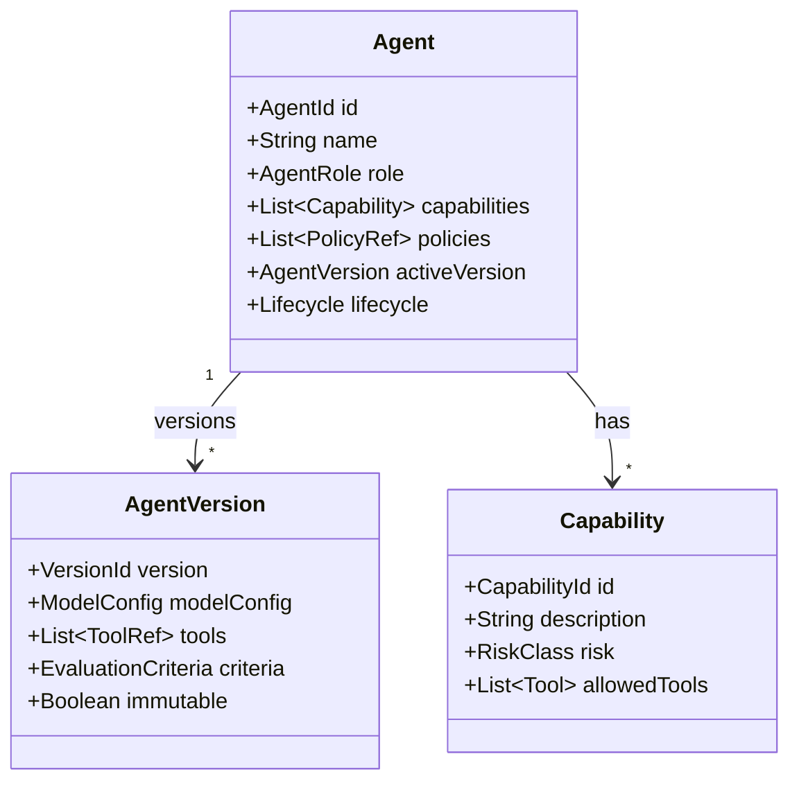

# Agent Model

## What Is an Agent

An Agent is a configured, versioned, capability-bounded AI actor. It has identity, role, purpose, permitted capabilities, policies, and evaluation criteria. An Agent is not an unbounded container of abilities.

## Agent Attributes

| Attribute | Description |
|---|---|
| AgentId | Unique identity |
| Name | Human-readable name |
| Role | Business role (e.g., Research Agent, Outreach Agent) |
| Purpose | Objective and scope |
| Capabilities | List of allowed capabilities |
| Tools | Tools permitted by capabilities |
| Policies | Policy references applied to the agent |
| KnowledgeAccess | Allowed knowledge categories |
| MemoryAccess | Allowed memory categories |
| ModelConfig | Preferred model class, cost/quality targets |
| AutonomyLevel | Default autonomy level |
| Version | Immutable published version |
| Lifecycle | Draft, Testing, Approved, Active, Deprecated, Retired |
| EvaluationCriteria | Success metrics for the agent |
| FailurePolicy | How failures are handled |
| EscalationPolicy | When and how to escalate |

## Agent Identity

- Every agent has a persistent AgentId.
- Agent versions are immutable snapshots.
- Executions reference a specific agent version.
- Agents authenticate as service identities.

## Agent Authority

- Authority is derived from capabilities and policies.
- Capabilities grant tool access; policies restrict it.
- No agent can self-elevate.
- Authority is evaluated per action by Control Plane.

## Agent Capabilities

Capabilities are coarse-grained permissions such as:

- `ResearchCompany`
- `EnrichContact`
- `EvaluateICP`
- `QualifyLead`
- `DraftOutreach`
- `HandleConversation`
- `ScheduleMeeting`
- `UpdateCRM`

Each capability maps to allowed tools and risk classification.

## Agent Lifecycle

```
Draft → Testing → Approved → Active → Deprecated → Retired
```

- Draft: under development
- Testing: being evaluated
- Approved: cleared for use
- Active: used in missions
- Deprecated: no longer recommended
- Retired: cannot be used

## Agent Versioning

- New versions are created for any material change.
- Active versions are immutable.
- Missions reference a specific version.
- Rollback to previous approved version supported.

## Agent Model Diagram


