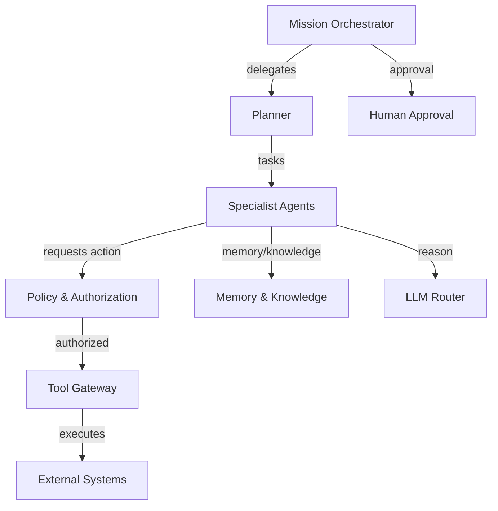

# Agent Topology

## Recommended Topology

```
Mission Orchestrator
        ↓
    Planner
        ↓
Specialist Agents
        ↓
Policy & Authorization Layer
        ↓
    Tool Gateway
        ↓
External Systems
```

## Recommended: Mission Orchestrator + Planner + Specialist Agents

| Layer | Component | Responsibility |
|---|---|---|
| Orchestration | Mission Orchestrator | Coordinates mission state, delegates tasks, handles events, manages human approvals |
| Planning | Planner | Creates and revises plans; does not execute external actions |
| Execution | Specialist Agents | Execute narrow, capability-bounded tasks |
| Governance | Policy & Authorization | Evaluates every action; cannot be bypassed |
| Integration | Tool Gateway | Executes approved tools with audit and validation |

## Why This Topology

- Clear separation of concerns.
- Orchestrator does not contain specialist business logic.
- Planner is independent from execution.
- Policy enforcement is centralized and authoritative.
- Specialist agents can be developed, evaluated, and scaled independently.
- Failure in one specialist does not collapse the whole mission.

## Minimum Coherent Specialist Agent Set

| Specialist Agent | Responsibility | Capabilities |
|---|---|---|
| Research Agent | Discover and research companies/contacts | ResearchCompany, EnrichContact |
| ICP Qualification Agent | Evaluate companies against ICP | EvaluateICP |
| Lead Qualification Agent | Qualify/disqualify leads | QualifyLead |
| Buying Signal Agent | Detect and score buying signals | DetectBuyingSignal |
| Outreach Strategist Agent | Decide outreach strategy and timing | PlanOutreach |
| Outreach Writer Agent | Generate personalized messages | DraftOutreach |
| Conversation Agent | Handle replies and maintain dialogue | HandleConversation |
| Meeting Agent | Schedule and manage meetings | ScheduleMeeting |
| CRM Agent | Prepare and reconcile CRM updates | PrepareCRMUpdate |
| Follow-up / Nurture Agent | Manage follow-up cadence | PlanFollowUp |
| Compliance / Safety Monitor Agent | Monitor policy/safety during execution | MonitorSafety |

## Alternative Topologies Evaluated

### 1. Single General-Purpose Agent

- **Pros**: Simplicity, one context window, easy orchestration.
- **Cons**: Poor cohesion, broad authority, hard to evaluate and secure, cannot scale specialist capabilities independently.
- **Verdict**: Rejected. Violates authority, observability, and evaluation requirements.

### 2. Planner + Executors

- **Pros**: Clean planning/execution split.
- **Cons**: Executors can become too generic; loses domain specialization and clear ownership.
- **Verdict**: Partially valid, but less cohesive than domain specialist agents; absorbed into recommended topology.

### 3. Hybrid / Swarm

- **Pros**: Flexible, emergent problem solving.
- **Cons**: Hard to debug, non-deterministic, security/audit boundaries blur.
- **Verdict**: Rejected for initial architecture; may be revisited for experimental capabilities under strict governance.

## Conditions for Topology Change

- New mission types require fundamentally different coordination patterns.
- Specialist count grows beyond manageable size.
- Latency requirements demand in-process planning.
- Multi-agent research proves better for a specific task.

## Migration Path

- Introduce new specialists without changing orchestrator contract.
- Move Planner in-process if needed while keeping interface.
- Extract Mission Orchestrator to a service when mission volume requires it.
- Add hierarchical supervision only after proving necessity.

## Topology Diagram



## Proposed ADR

See `/docs/ai/ai-decisions/AID-001.md` — Multi-Agent Topology.
