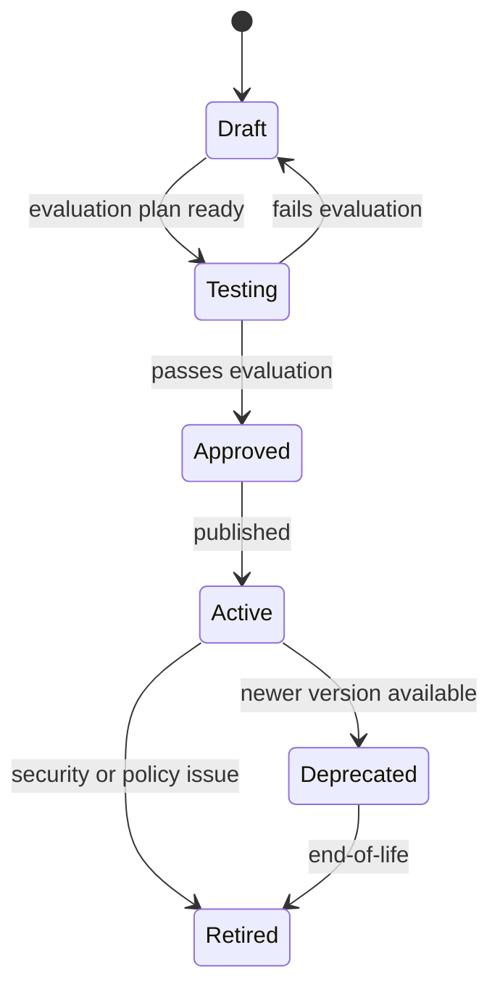

# Agent Lifecycle

## Lifecycle States

| State | Meaning |
|---|---|
| Draft | Agent definition under development |
| Testing | Under evaluation in controlled environment |
| Approved | Cleared for tenant activation |
| Active | Available for mission assignment |
| Deprecated | No longer recommended; existing missions may continue |
| Retired | Cannot be assigned or executed |

## Transitions

## Lifecycle Activities

### Draft

- Define role, purpose, capabilities, policies.
- Select model class and tool set.
- Author evaluation criteria.

### Testing

- Run against golden datasets.
- Evaluate safety, policy compliance, cost, latency.
- Review outputs for hallucinations and unsupported claims.
- Iterate and re-test.

### Approved

- Version is immutable.
- Approved by AI governance / compliance.
- Eligible for feature-flag rollout.

### Active

- Missions may reference the version.
- Telemetry collected.
- Continuous evaluation against outcomes.

### Deprecated

- New missions use newer version.
- Existing missions continue with prior version unless migrated.

### Retired

- No new executions.
- Historical executions retained for audit and learning.

## Version Management

- Semantic versioning for agent definitions.
- Major version for capability/policy changes.
- Minor version for prompt/config improvements.
- Patch version for non-behavioral fixes.

## Promotion and Rollback

- Promotion gated by evaluation results and human approval for high-risk agents.
- Rollback to last approved version supported.
- Rollback does not alter historical executions.

## Audit

- Lifecycle transitions logged to Audit Service.
- Who approved, when, and on what basis.
- Evaluation results linked to version.
