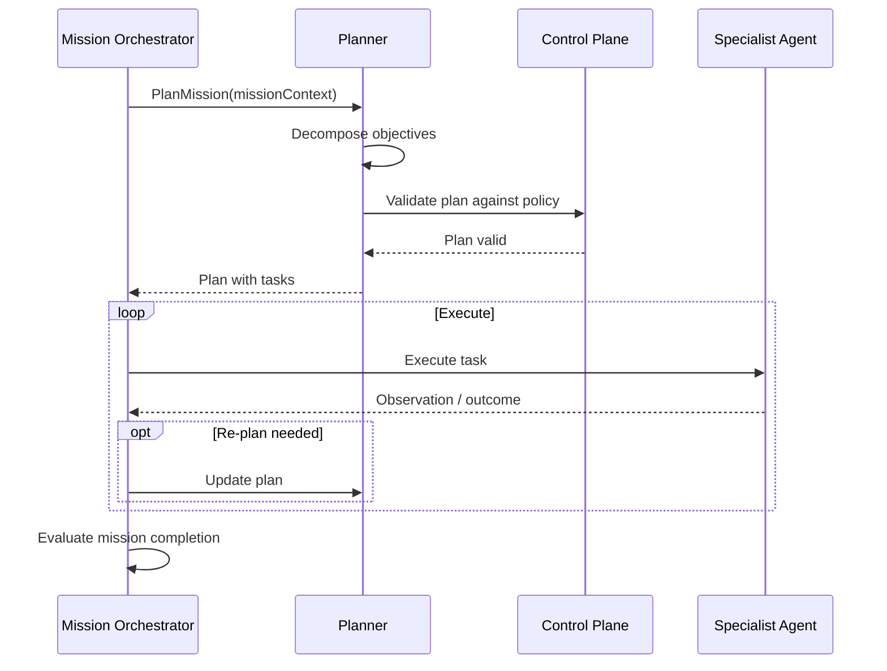

# Mission Planning

## Planning Model

| Concept | Definition |
|---|---|
| Goal | High-level business objective |
| Mission | Scoped, time-bound revenue objective |
| Objective | Measurable mission target |
| Plan | Ordered set of sub-plans and tasks |
| Sub-plan | Coherent group of tasks for a specialist |
| Task | Single unit of work assigned to an agent |
| Action | Concrete step executed via tool |
| Observation | Result of an action or external event |
| Outcome | Business result of mission/task execution |

## Planner Responsibilities

- Create initial plan from mission objective, ICP, and constraints.
- Revise plan based on observations and outcomes.
- Decompose objectives into specialist tasks.
- Ensure plans respect budget, timeframe, and policy.
- Produce human-readable plan rationale.
- Do not execute external actions directly.

## Plan Components

- Mission objective and success criteria
- Constraints (budget, channels, timing, no-contact rules)
- Sequence of phases
- Specialist task assignments
- Decision points and approval gates
- Fallback branches
- Completion and failure criteria

## Dynamic Planning

- Plans are not static scripts.
- Planner reacts to prospect behavior, new signals, failures, and approvals.
- Re-planning triggered by:
  - Low confidence in lead qualification
  - Negative reply or opt-out
  - Calendar conflict
  - CRM sync failure
  - Policy change
  - Human override

## Plan Validation

- Schema validation
- Policy compliance check
- Resource budget check
- Capability match with available agents
- Approval gate placement
- Fallback completeness

## Plan Monitoring

- Track plan execution state.
- Detect deviations.
- Trigger re-planning when needed.
- Record plan versions for audit.

## Mission Planning Flow

