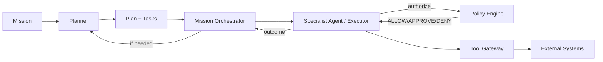

# Planning vs Execution

## Separation Principle

Planning decides **what should be done**; execution decides **how it is carried out**.

| Concern | Planner | Executor |
|---|---|---|
| What | Objectives, sequence, tasks | Concrete actions and tool calls |
| Why | Business rationale | Technical/operational rationale |
| When | Timing and dependencies | Real-time execution |
| Who | Which specialist agent | Specific tool/provider invocation |
| Risk | Identifies approval gates | Enforces policy at action time |

## Planner Responsibilities

- Build and revise plans.
- Place approval gates.
- Allocate tasks to specialists.
- Define fallback branches.
- Ensure plan coherence.

## Executor Responsibilities

- Receive task from orchestrator.
- Load specialist agent and version.
- Assemble context.
- Request policy evaluation.
- Call LLM for reasoning/action selection.
- Validate and execute tools.
- Validate outputs.
- Record outcomes and evidence.
- Report success/failure/approval.

## Policy as Mediator

- Planner can propose actions but cannot authorize them.
- Executor must query Control Plane before any external action.
- Policy evaluation happens at execution time with full context.

## Why Separate

- Prevents planner from committing to unauthorized actions.
- Allows execution-time policy enforcement with latest rules.
- Enables human approval between plan and action.
- Simplifies testing: planner outputs can be validated without side effects.

## Planning-Execution Flow

