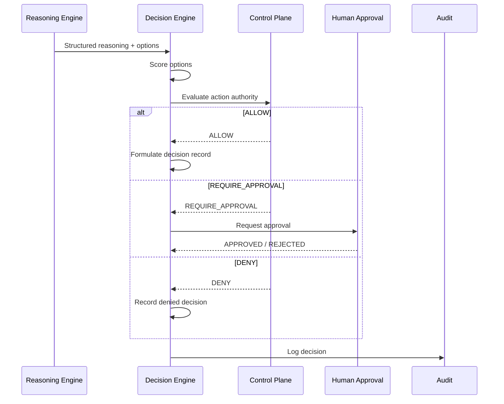

# Decision Architecture

## Decision Model

Every important AI decision is represented as a structured record:

| Field | Meaning |
|---|---|
| DecisionId | Unique identifier |
| DecisionType | Classification of decision |
| AgentId / Version | Who decided |
| MissionId | Mission context |
| TenantId | Tenant context |
| Evidence | Supporting evidence references |
| Confidence | Normalized confidence |
| Policy | Policy and autonomy context |
| Risk | Risk classification |
| ExpectedOutcome | Predicted result |
| SelectedAction | Action chosen |
| Alternatives | Actions considered and rejected |
| ApprovalStatus | ALLOW / REQUIRE_APPROVAL / DENY |
| HumanDecision | If approved/rejected by human |
| Timestamp | Decision time |

## Decision Types

- `ICPMatchDecision`
- `LeadQualificationDecision`
- `OutreachStrategyDecision`
- `MessagePersonalizationDecision`
- `ReplyHandlingDecision`
- `MeetingSchedulingDecision`
- `CRMUpdateDecision`
- `FollowUpDecision`
- `EscalationDecision`

## Decision Classifications

| Classification | Meaning |
|---|---|
| Fact | Observable, verifiable data |
| Inference | Derived conclusion from facts |
| Assumption | Accepted without direct evidence |
| Prediction | Forecast of future state |
| Uncertainty | Known limitation |

## Decision Confidence

- Normalized score (0.0–1.0).
- Confidence thresholds configured per decision type.
- Low confidence triggers escalation, additional evidence, or human approval.
- Confidence is not authority; policy decides authority.

## Decision Flow

## Decision Audit

- Every decision record appended to Audit Service.
- Links to evidence, policy evaluation, and execution outcome.
- Supports post-hoc review and compliance.
