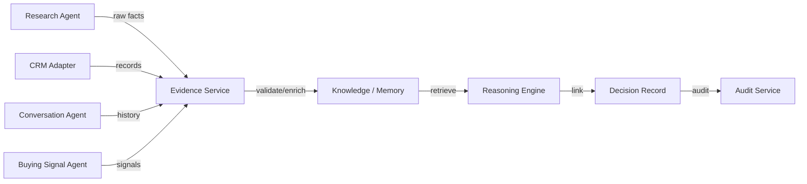

# Evidence Architecture

## Purpose

Every important AI decision must be explainable through supporting evidence. Evidence architecture defines how evidence is sourced, validated, stored, and linked to decisions.

## Evidence Attributes

| Attribute | Meaning |
|---|---|
| EvidenceId | Unique identifier |
| Source | Where the evidence came from |
| Type | Fact, inference, signal, external data |
| Content | The evidence itself (summary) |
| Timestamp | When evidence was observed |
| Freshness | Relevance window |
| Reliability | Source reliability score |
| Confidence | Extraction/interpretation confidence |
| TenantId | Ownership |
| RelatedEntity | Company, contact, lead, mission |

## Evidence Sources

- Web research results
- External data providers
- CRM records (via adapter)
- Email/calendar data
- Conversation history
- Buying signal detectors
- Human-provided data
- Previous AI decisions
- System knowledge

## Evidence Lifecycle

1. **Collection** — gather raw data from sources.
2. **Extraction** — parse relevant facts.
3. **Validation** — check schema, source, and plausibility.
4. **Enrichment** — add metadata (freshness, reliability, confidence).
5. **Linking** — associate with decisions and entities.
6. **Expiration** — mark stale evidence.
7. **Correction** — update or retract if disproven.

## Evidence Rules

- Unsupported claims cannot be used as evidence.
- Evidence must be attributable to a source.
- Stale evidence reduces confidence.
- Conflicting evidence triggers reconciliation or escalation.
- Evidence is tenant-scoped.

## Examples of Evidence-Backed Decisions

| Decision | Evidence Required |
|---|---|
| ICP match | Company size, industry, tech stack, growth signals |
| Lead qualified | ICP match, buying signals, contact authority |
| Person selected | Role, seniority, relevance, engagement history |
| Message generated | Company context, pain points, recent events, previous interactions |
| Meeting pursued | Expressed interest, timing, availability, qualification |
| Opportunity created | Lead status, engagement, estimated value, fit |

## Evidence Architecture Diagram

