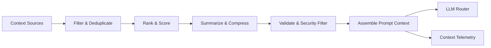

# Context Engineering

## Purpose

Context Engineering assembles the right information for an LLM or agent task without indiscriminately dumping data. It selects, ranks, compresses, summarizes, and filters context by relevance, freshness, security, and token budget.

## Context Sources

- System instructions
- Agent configuration and version
- Mission objective and constraints
- Plan and current task
- Tenant configuration and policies
- ICP definition
- Target company profile
- Target contact profile
- Conversation history
- Relevant knowledge items
- Relevant memory
- Recent research/evidence
- Previous decisions
- Tool descriptions
- Autonomy level
- Approval context

## Context Processing Pipeline

```
Gather → Filter by tenant → Rank by relevance → Deduplicate → Summarize → Compress → Validate → Assemble
```

## Selection Criteria

| Criterion | How Applied |
|---|---|
| Relevance | Vector similarity + keyword + metadata matching |
| Freshness | Recency boosting; stale data flagged |
| Authority | Prefer verified sources over inferences |
| Tenant isolation | Exclude all cross-tenant data |
| Sensitivity | Redact or exclude PII where policy requires |
| Token budget | Truncate or summarize to fit model context |
| Task specificity | Include only task-relevant context |

## Compression and Summarization

- Long conversation histories summarized.
- Research results distilled to key facts.
- Knowledge items chunked and top-N selected.
- Memory consolidated across interactions.
- Summaries retain source references for evidence.

## Token Budgeting

- Each task has a target token budget.
- Context assembler prioritizes must-have information.
- Low-priority context omitted or summarized.
- Budget tracked in telemetry.

## Security Filtering

- Remove or tokenize PII before inclusion.
- Exclude data from other tenants.
- Strip system-level secrets.
- Apply tenant-specific data classification rules.

## Context Versioning

- Context assembly strategy versioned with agent version.
- Changes to context selection logged.
- A/B evaluation of context strategies supported.

## Context Engineering Diagram


