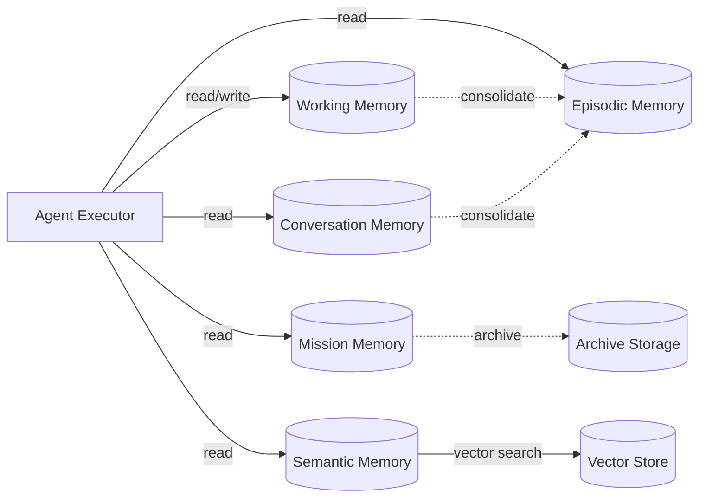

# Memory Architecture

## Memory Types

| Type | Scope | Purpose | Owner |
|---|---|---|---|
| Working Memory | Single execution | Short-term task context | Agent Executor |
| Mission Memory | Mission | Decisions, observations, outcomes within a mission | Mission Orchestrator |
| Conversation Memory | Conversation | Message thread, intent, state | Conversation Agent |
| Episodic Memory | Tenant | Past executions and outcomes | AI Execution Plane |
| Semantic Memory | Tenant | Long-term facts about entities | Knowledge & Memory Service |
| Agent Memory | Agent | Learned patterns for a specific agent | Knowledge & Memory Service |
| Tenant Memory | Tenant | Customer-specific configuration and templates | Knowledge & Memory Service |
| Contact Memory | Contact | Interaction history and preferences | Conversation Agent |
| Company Memory | Company | Research findings and signals | Research Agent |
| Outcome Memory | Tenant | Results of past actions for learning | Analytics / Learning |

## Memory Ownership and Access

- Each memory item has a clear owner (agent, mission, conversation, tenant).
- Access is governed by capability and policy.
- Tenant isolation enforced; no cross-tenant memory retrieval.
- Global system knowledge is read-only to agents.

## Memory Properties

- **Content**: The memory itself.
- **Source**: Which agent/process created it.
- **Confidence**: Reliability of the memory.
- **Freshness**: Validity window.
- **Importance**: Significance score.
- **TenantId**: Ownership.
- **EntityId**: Related company/contact/lead/conversation.
- **Version**: Memory item version.

## Memory Retrieval

- Vector similarity for semantic recall.
- Structured query for exact recall.
- Hybrid retrieval combining both.
- Recency and importance boosting.
- Tenant and entity filters.

## Memory Write Policy

See `13-memory-write-policy.md`. Key rule: agents cannot automatically write arbitrary model output to long-term memory.

## Memory Retention

- Per-tenant retention policies.
- Conversation memory retained per conversation lifecycle.
- Mission memory retained per mission lifecycle plus archive period.
- Episodic memory retained for learning as configured.
- Expired memory moved to cold storage or deleted.

## Memory Architecture Diagram

