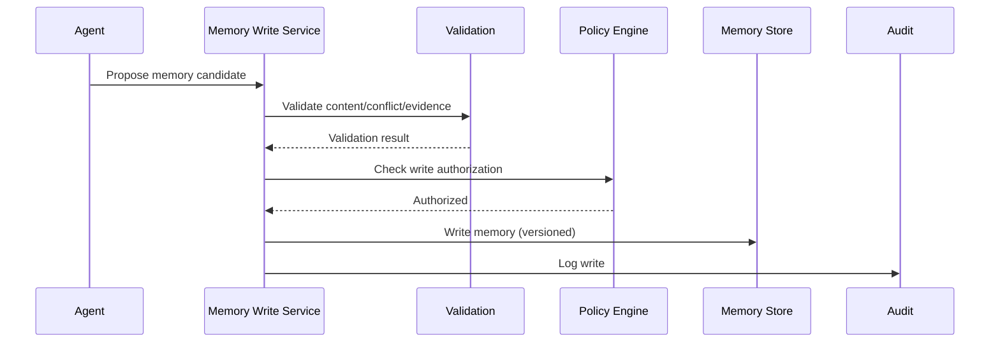

# Memory Write Policy

## Principle

Agents must NOT automatically write arbitrary model output into long-term memory. Memory writes are deliberate, validated, authorized, and attributable.

## Memory Candidate

A candidate for memory write is identified by the agent or evaluation process. It includes:

- Content
- Source
- Confidence
- Importance
- Related entity
- Evidence references
- Proposed retention

## Validation

Before writing to long-term memory:

- Content must be factual or clearly marked as inference/assumption.
- Evidence must be present for factual claims.
- Confidence must exceed threshold for the memory type.
- No contradictions with existing high-confidence memory.
- No PII unless permitted and classified.
- Tenant scope verified.

## Authorization

- Memory write requires capability `WriteMemory`.
- Policy may restrict which agents can write which memory types.
- High-impact memory writes may require approval or human review.

## Conflict Resolution

- New memory conflicting with existing memory triggers reconciliation.
- Higher-confidence, fresher evidence may override older memory.
- Persistent conflicts escalated to human review.
- All updates versioned and audited.

## Memory Operations

| Operation | Policy |
|---|---|
| Create | Validated, authorized, attributed |
| Update | Versioned, conflict-checked |
| Delete | Authorized, soft-delete with audit |
| Expire | Automated per retention policy |
| Correct | Human or authorized agent, versioned |

## Anti-Patterns

- Do not dump entire LLM outputs into memory.
- Do not allow memory to override policy or security.
- Do not write cross-tenant data.
- Do not write without evidence for factual claims.

## Memory Write Flow

## Memory ≠ Authority

Memory is a source of context, not permission. Security, authorization, policy, and tenant boundaries always take precedence over remembered information.
