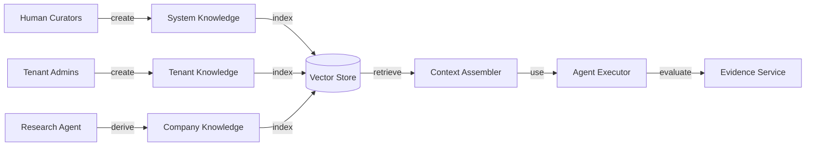

# Knowledge Architecture

## Knowledge Categories

| Category | Description | Owner |
|---|---|---|
| System Knowledge | Platform-wide patterns, guardrails, templates | Platform Administrator |
| Tenant Knowledge | Customer-specific value props, templates, policies | Customer Administrator |
| Customer Knowledge | End-customer product/industry knowledge | Customer Administrator |
| Market Knowledge | Industry trends, competitive landscape | Research / Curated |
| Company Intelligence | Research-derived facts about companies | Research Agent |
| Product Knowledge | Product features, pricing, use cases | Product Management |
| Dynamics 365 Knowledge | Provider-specific mapping and constraints | Integration Team |
| Conversation Knowledge | Learned response patterns (not truth) | Conversation Agent |
| Research Results | Normalized findings from external sources | Research Agent |

## Knowledge Item Structure

- KnowledgeId
- TenantId (or global)
- Category
- Content
- Embedding vector
- Source
- Confidence
- Freshness / validity period
- Tags
- Version
- Access control list

## Ownership

- System knowledge is read-only to tenants and agents.
- Tenant knowledge is owned by the tenant.
- Company/contact knowledge is derived by research agents and validated.
- Product knowledge is curated by product team.

## Retrieval

- Semantic search via vector store.
- Metadata/tag filtering.
- Hybrid ranking.
- Source and freshness displayed.
- Tenant isolation enforced.

## Freshness and Provenance

- Every knowledge item has a source and timestamp.
- Stale knowledge flagged.
- Research-derived knowledge linked to evidence.
- Provenance tracked for audit and correction.

## Knowledge ≠ Truth

- Knowledge is a model input, not authoritative fact.
- Decisions require evidence and confidence.
- Knowledge can be corrected, retracted, or versioned.
- High-confidence, verified knowledge may be treated as fact within policy.

## Knowledge Architecture Diagram

