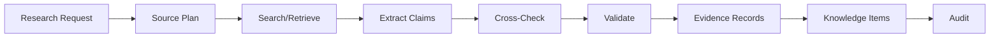

# Research Architecture

## Purpose

The Research Architecture defines how the AI gathers, extracts, validates, and transforms external information into evidence and knowledge without allowing arbitrary web content to become trusted truth.

## Research Process

| Stage | Activity | Output |
|---|---|---|
| Request | Define research objective, target, and required evidence | ResearchRequest |
| Source Selection | Choose sources based on reliability, coverage, cost | SourcePlan |
| Search / Retrieval | Query web search, providers, databases | Raw results |
| Extraction | Parse facts, entities, signals | Structured claims |
| Cross-Checking | Verify against multiple sources where possible | Confidence adjustment |
| Validation | Schema, plausibility, source reliability checks | Validated evidence |
| Evidence Creation | Link claims to sources, freshness, confidence | Evidence records |
| Knowledge Write | Store normalized knowledge | KnowledgeItem |
| Completion | Signal research completion | ResearchCompleted event |

## Source Selection Criteria

- Reliability (official sources, reputable data providers, public records)
- Coverage (completeness for target type)
- Cost (API cost, compute cost)
- Rate limits
- Freshness
- Legal/compliance permissibility
- Tenant configuration

## Research Request

- Research objective
- Target (company, contact, market)
- Required evidence types
- Confidence thresholds
- Source preferences/restrictions
- Budget/time constraints
- Tenant and mission context

## Extraction

- Named entity extraction
- Role/seniority inference
- Company attributes (size, industry, tech stack)
- Signal detection (hiring, funding, expansion)
- Relationship mapping
- Confidence scoring

## Cross-Checking

- Compare multiple sources.
- Flag contradictions.
- Boost confidence on corroboration.
- Downgrade confidence on conflicting data.
- Surface conflicts for human review when critical.

## Trust Boundaries

- Raw web content is untrusted until validated.
- Claims from premium data providers receive higher base reliability but still require validation.
- User-provided data is treated as a source with configurable reliability.
- No raw HTML or scraped content enters domain logic.

## Research Agents

- Research Agent: discovers and enriches companies/contacts.
- Buying Signal Agent: detects and scores signals.
- Evidence Validator: checks source reliability and claim plausibility.

## Research Architecture Diagram

