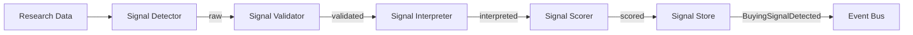

# Buying Signal Intelligence

## Purpose

Buying Signal Intelligence identifies and scores observable events that indicate a prospect may be in-market for the solution. Signals are separated from interpretations and confidence.

## Signal Categories

| Category | Examples |
|---|---|
| Growth | Hiring spree, new offices, expansion |
| Funding | Raised capital, IPO, acquisition |
| Leadership | New CIO/CTO/CFO, leadership changes |
| Technology | ERP migration, cloud adoption, tech stack changes |
| Digital Transformation | New systems initiatives, process modernization |
| Business Change | M&A, divestiture, restructuring |
| Pain Indicators | Compliance issues, outage reports, negative reviews |
| Competitive Pressure | Competitor wins, market share shifts |
| Industry Tailwinds | Regulatory changes, market trends |

## Signal Model

| Attribute | Meaning |
|---|---|
| SignalId | Unique identifier |
| SignalType | Category of signal |
| ObservedSignal | Raw observed fact |
| InterpretedSignal | Business meaning assigned by AI |
| Source | Where observed |
| Entity | Related company/contact |
| Confidence | Extraction/interpretation confidence |
| BusinessRelevance | Relevance to tenant's offering |
| Recency | How recent |
| Evidence | Supporting evidence references |

## Signal Detection Process

1. Research Agent gathers data.
2. Signal detector extracts candidate signals.
3. Validator checks source and plausibility.
4. Interpreter assigns business meaning and relevance.
5. Scorer combines confidence, relevance, recency.
6. Signal stored as evidence/knowledge.
7. `BuyingSignalDetected` event emitted.

## Signal Scoring

- Confidence (0.0–1.0)
- Relevance to ICP (0.0–1.0)
- Recency weight
- Source reliability
- Composite score used for prioritization

## Separation of Concerns

- **Observed Signal**: factual event.
- **Interpreted Signal**: business relevance.
- **Confidence**: reliability of extraction and interpretation.
- **Action**: only taken after policy evaluation.

## Signal Decay

- Signals have freshness windows.
- Old signals down-weighted or expired.
- Repeated signals may reinforce or indicate noise.

## Buying Signal Architecture Diagram

