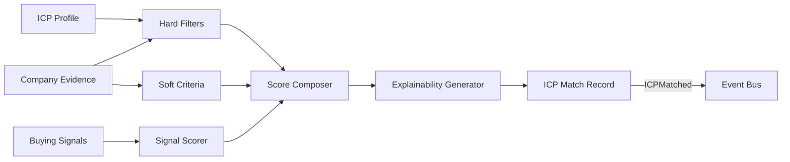

# ICP Intelligence

## Purpose

ICP Intelligence evaluates companies against the Ideal Customer Profile using hard filters, soft criteria, positive/negative signals, and evidence-backed reasoning. Scoring must be explainable, not a black box.

## ICP Components

| Component | Examples |
|---|---|
| Hard Filters | Industry, geography, company size, employee count, revenue |
| Soft Criteria | Growth rate, tech stack fit, organizational maturity |
| Positive Signals | Hiring in target roles, technology migration, funding |
| Negative Signals | Competitor lock-in, recent layoffs, bad fit |
| Disqualifiers | Outside territory, prohibited industry, suppression |

## ICP Match Model

| Field | Meaning |
|---|---|
| MatchId | Evaluation identifier |
| CompanyId | Target company |
| ICPProfileId | Profile used |
| HardFilterResult | Pass / Fail |
| SoftScore | Numeric score |
| SignalScore | Combined signal contribution |
| MatchScore | Overall score |
| Confidence | Confidence in score |
| Evidence | References supporting evaluation |
| Explainability | Human-readable rationale |

## Scoring Pipeline

1. Apply hard filters (binary pass/fail).
2. Evaluate soft criteria against company profile.
3. Aggregate positive and negative signals.
4. Compute weighted match score.
5. Generate explainability summary.
6. Emit `ICPMatched` event.

## Explainability Requirements

- Which hard filters passed/failed.
- Top positive and negative factors.
- Source and freshness of evidence.
- Confidence per factor.
- Overall reasoning summary.

## ICP Configuration

- Tenant-defined ICP profiles.
- Weights and thresholds per profile.
- Allowed/required evidence types.
- Minimum confidence thresholds.
- Disqualification rules.

## ICP Evaluation Agent

- Loads ICP profile and company evidence.
- Applies deterministic filters.
- Uses reasoning for soft criteria.
- Produces structured ICP match record.
- Does not execute external actions.

## ICP Intelligence Diagram

