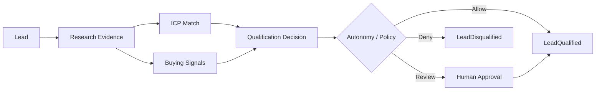

# Lead Qualification Architecture

## Purpose

Lead Qualification determines whether a prospect meets the criteria to become a sales-qualified lead, using research, evidence, and policy-bounded autonomy. It separates raw lead, research, evidence, qualification, and recommendation.

## Qualification Model

| Stage | Output |
|---|---|
| Raw Lead | Company/contact identified |
| Research | Company/contact evidence gathered |
| ICP Match | ICP evaluation result |
| Buying Signals | Relevant signals detected |
| Qualification Decision | Qualified / Not Qualified / Needs Review |
| Confidence | Score |
| Reason | Evidence-backed rationale |
| Recommendation | Suggested next action |
| Approval | Human approval if required |
| Status | Final qualification status |

## Qualification Criteria

- ICP match score above threshold
- Relevant buying signals present
- Decision-maker/contact identified
- No disqualifiers
- No suppression
- Budget/indication of need (where available)
- Tenant-specific business rules

## Qualification Process

1. Load lead and related company/contact.
2. Retrieve research evidence.
3. Evaluate ICP match.
4. Detect and score buying signals.
5. Apply business rules and disqualifiers.
6. Produce qualification decision with confidence and reason.
7. Evaluate autonomy level and risk.
8. If required, create approval task.
9. Emit `LeadQualified` or `LeadDisqualified` event.

## Human Review Triggers

- Confidence below threshold
- Conflicting evidence
- High-value/high-risk prospect
- Disqualification override requested
- Autonomy level requires approval

## Lead Qualification Agent

- Read-only evaluation by default.
- Creates qualification record.
- Does not send outreach or book meetings.
- Authority limited to qualification decisions.

## Lead Qualification Diagram

