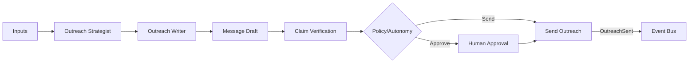

# Outreach Intelligence

## Purpose

Outreach Intelligence generates personalized, evidence-backed outreach. It combines company context, contact context, buying signals, pain indicators, and business hypotheses to decide message strategy, content, tone, CTA, and timing.

## Inputs

| Input | Source |
|---|---|
| Company context | Research Agent / knowledge |
| Contact context | Contact intelligence |
| Role | Contact profile |
| Pain indicators | Buying signals, business change, industry trends |
| Buying signals | Signal intelligence |
| Industry | Company profile / knowledge |
| Recent events | Research / news |
| Business hypothesis | ICP + tenant value proposition |
| Customer offering | Tenant knowledge |
| Conversation history | Conversation memory |
| Previous interactions | Outcome memory |

## Outreach Strategy

| Element | Decision |
|---|---|
| Channel | Email, LinkedIn, other |
| Timing | When to send |
| Sequence position | First touch, follow-up, nurture |
| Tone | Professional, casual, urgent, consultative |
| Personalization | What to reference |
| CTA | Meeting booking, reply, content download |
| Length | Short, medium, detailed |
| Follow-up plan | Cadence if no response |

## Content Generation

- Outreach Strategist Agent decides strategy.
- Outreach Writer Agent generates message draft.
- Evidence must support claims made in the message.
- No unsupported claims or fabricated facts.
- Personalization anchored to verified signals.
- Compliance with anti-spam, opt-out, and brand policies.

## Validation

- Claim verification against evidence.
- Tone and brand policy check.
- Compliance check (suppression, opt-out, legal).
- CTA appropriateness.
- Length and readability.
- Personalization non-creepy check.

## Approval

- Message drafts approved or sent based on autonomy level.
- High-risk first-touch or sensitive topics require approval.
- Approval context includes strategy, draft, evidence, and risk.

## Outcome Tracking

- Delivery, open, click, reply.
- Sentiment and intent classification.
- Meeting booking outcome.
- Disqualification outcome.
- Used to evaluate outreach strategy and writer agents.

## Outreach Intelligence Diagram

