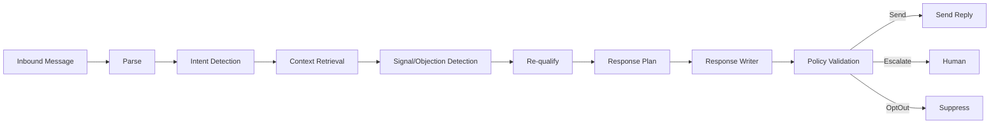

# Conversation Intelligence

## Purpose

Conversation Intelligence handles inbound replies, detects intent and buying signals, manages conversation state, plans responses, validates policy, and escalates to humans when needed. It is not prompt chaining.

## Components

| Component | Responsibility |
|---|---|
| Inbound Processor | Parse and normalize incoming messages |
| Intent Detector | Classify intent (reply, question, objection, interest, opt-out, referral) |
| Context Retriever | Load conversation history, company/contact, mission context |
| Signal Detector | Detect buying signals and objections |
| Qualifier | Re-evaluate lead/conversation qualification |
| Response Planner | Determine response strategy |
| Response Writer | Generate reply draft |
| Policy Validator | Check compliance and autonomy |
| Escalator | Route to human when required |
| State Manager | Maintain conversation state and transitions |

## Conversation State

- Active
- Awaiting Approval
- Awaiting Human
- Qualified
- Meeting Scheduled
- Disqualified
- Opted Out
- Escalated
- Closed

## Intent Classification

| Intent | Action |
|---|---|
| Positive reply | Qualify, move toward meeting |
| Question | Answer or route to human |
| Objection | Address or escalate |
| Interest | Deepen engagement |
| Unsubscribe/Opt-out | Honor immediately, update suppression |
| Not interested | Disqualify gracefully |
| Referral | Capture new contact |
| Spam/abuse | Close and report |

## Response Planning

- Decide whether to reply, wait, escalate, or close.
- Determine response goal (answer, qualify, book meeting, nurture).
- Select tone and length.
- Avoid over-messaging.
- Respect silence and follow-up cadence.

## Escalation Triggers

- Unclear intent or context
- Request for human
- Negative sentiment or complaint
- Pricing or contractual question
- Technical question beyond agent scope
- Policy violation detected
- High-value prospect
- Repeated failed replies

## Conversation Memory

- Full thread retained.
- Key facts and commitments extracted.
- Entity state updated.
- Outcomes linked to mission.

## Compliance

- Opt-outs honored immediately.
- Unsubscribe links included where required.
- PII handled per policy.
- Audit trail for every message.

## Conversation Intelligence Diagram

