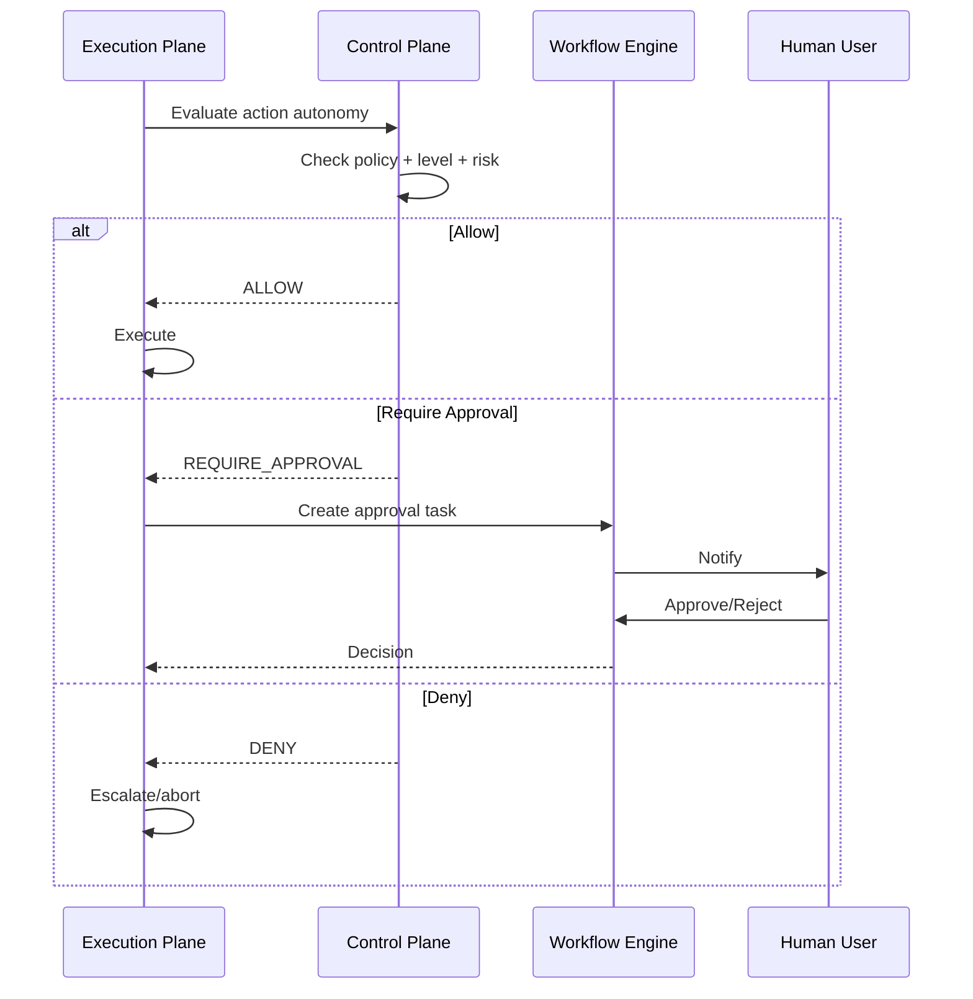

# Autonomy Architecture

## Autonomy Levels

The runtime architecture supports six autonomy levels aligned with the business autonomy model:

| Level | Name | Runtime Decision |
|---|---|---|
| 0 | Human Only | Agent provides data only when explicitly requested; no autonomous actions. |
| 1 | AI Recommendation | Agent drafts recommendations; human reviews and triggers execution. |
| 2 | AI Draft + Human Approval | Agent drafts actions; system pauses for human approval before execution. |
| 3 | Controlled Autonomous Actions | Agent executes low-risk actions; high-risk actions require approval. |
| 4 | Policy-Bounded Autonomous Execution | Agent executes most actions within policy; destructive/contractual actions require approval. |
| 5 | Highly Autonomous Mission Execution | Agent runs full missions within policy; continuous monitoring. |

## Autonomy Enforcement Points

1. **Control Plane policy evaluation** — before action, returns ALLOW / REQUIRE_APPROVAL / DENY.
2. **Workflow engine gates** — inserts approval tasks.
3. **Tool Gateway** — rejects unauthorized tool calls.
4. **Outbound communication gateway** — blocks unapproved messages.
5. **CRM integration** — requires approval for writes above configured level.

## Autonomy Configuration

- Default per tenant.
- Per-mission override.
- Per-action-type override.
- Industry/prospect sensitivity may raise effective level.
- Compliance admin sets maximum allowed level.
- Feature flags can restrict levels.

## Autonomy Decision Flow

## Non-Bypassable Guards

No autonomy level may bypass:

- Authentication and authorization
- Tenant isolation
- Policy rules
- Compliance constraints
- Approval requirements for destructive/contractual actions
- Audit logging

## Emergency Override

- Authorized users can pause/cancel any mission, workflow, or execution.
- Emergency stop propagates via events.
- All overrides audited.
