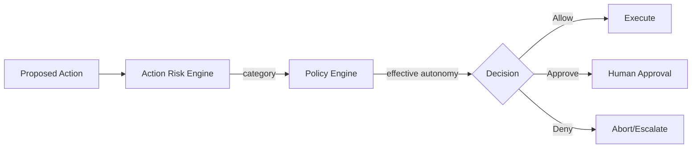

# Action Risk Engine

## Purpose

The Action Risk Engine classifies proposed AI actions into risk categories and maps them to autonomy levels, approval requirements, and tool restrictions. Risk classification is explicit, not implicit.

## Risk Categories

| Category | Examples | Default Autonomy |
|---|---|---|
| LOW | Research, read-only CRM queries, data enrichment, draft generation | Level 2+ |
| MEDIUM | Send personalized outreach, update lead status, schedule follow-up | Level 3+ |
| HIGH | Create opportunity, modify CRM records, send sensitive communications, book customer-facing meetings | Level 4+ |
| CRITICAL | Financial action, contractual commitment, irreversible external action, mass communication | Requires explicit approval regardless of autonomy |

## Risk Dimensions

| Dimension | Consideration |
|---|---|
| Reversibility | Can the action be undone? |
| External impact | Does it affect a prospect or customer? |
| Financial/legal exposure | Could it create liability or cost? |
| Data sensitivity | Does it involve PII or confidential data? |
| Tenant policy | Customer-specific rules |
| Mission context | High-value or sensitive mission |
| Tool risk | Tool-specific failure modes |
| Model confidence | Confidence in the decision |

## Risk Evaluation Flow

1. Agent proposes action.
2. Action Risk Engine determines category.
3. Maps category to autonomy requirement.
4. Compares against effective autonomy level.
5. Returns ALLOW, REQUIRE_APPROVAL, or DENY.
6. Records risk assessment in audit.

## Risk Configuration

- Tenant defaults.
- Per-mission overrides.
- Per-action-type mappings.
- Dynamic adjustment based on confidence or evidence quality.
- Hard-coded system minimums that cannot be overridden.

## Risk Engine Interface

```
ClassifyAction(actionContext) → RiskCategory
MapToAutonomy(riskCategory, context) → requiredLevel
Evaluate(effectiveAutonomy, riskCategory) → ALLOW / REQUIRE_APPROVAL / DENY
```

## Action Risk Diagram


