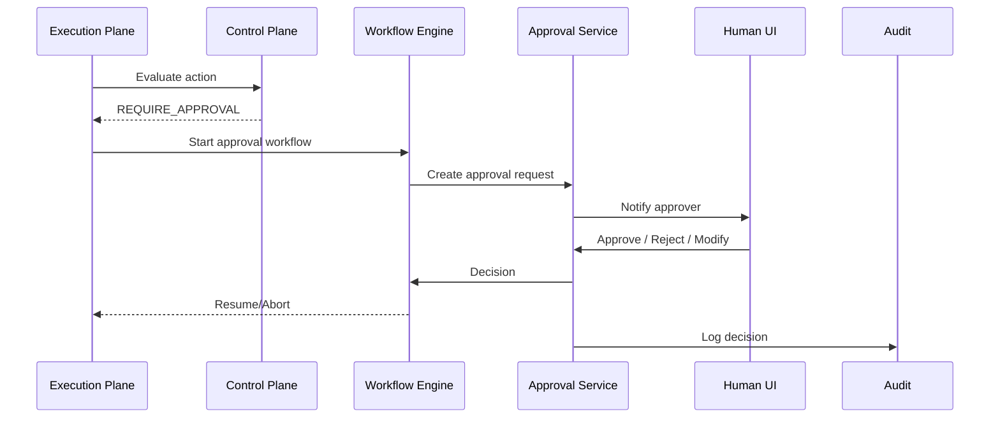

# Human-in-the-Loop

## Purpose

Human-in-the-loop is an architectural mechanism, not just a UI feature. It allows humans to approve, reject, modify, or override AI-proposed actions based on context, evidence, and risk.

## Approval Request Model

| Field | Meaning |
|---|---|
| ApprovalId | Unique identifier |
| TenantId | Tenant context |
| MissionId | Mission context |
| ExecutionId | Agent execution context |
| ActionType | Type of action |
| RiskCategory | Risk classification |
| ProposedAction | What the AI wants to do |
| Evidence | Supporting evidence references |
| Reasoning | Structured reasoning summary |
| Confidence | AI confidence |
| RequestedBy | Agent / system |
| ApproverRole | Required human role |
| Status | Pending / Approved / Rejected / Expired / Escalated |
| Timeout | Approval deadline |
| Decision | Approver's choice |
| DecisionReason | Human-provided rationale |

## Approval Types

| Type | Use Case |
|---|---|
| Pre-execution approval | Approve before action runs |
| Conditional approval | Approve with modifications |
| Post-hoc review | Review after low-risk autonomous action |
| Override | Reverse or modify AI decision |
| Emergency stop | Halt mission/agent/tenant |

## Approval Workflow

1. Execution Plane detects action requiring approval.
2. Creates approval request with full context.
3. Workflow engine starts approval timer.
4. Notification sent to appropriate human(s).
5. Human reviews evidence, reasoning, and proposed action.
6. Human approves, rejects, modifies, or escalates.
7. Decision recorded and propagated.
8. Execution resumes, aborts, or re-plans.
9. Audit log updated.

## Timeout and Escalation

- Configurable timeout per action type.
- On timeout: escalate to alternate approver, abort, or execute fallback.
- Escalation path defined per tenant/mission.
- Urgent actions may use push + email + in-app notifications.

## Human Override

- Authorized humans can override AI decisions.
- Override triggers audit and may re-evaluate policy.
- Overrides can pause mission or disable agent version.

## Emergency Stop

- Platform admin, compliance admin, or mission owner can stop mission/agent/tenant.
- Stop event propagated to execution plane.
- In-flight actions cancelled or paused.
- All emergency actions audited.

## Human-in-the-Loop Diagram

