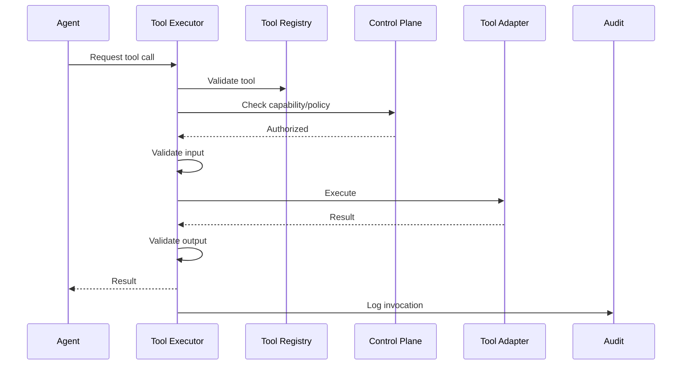

# Tool Use

## Purpose

Tools allow agents to interact with external and internal systems. Tool Use architecture ensures every invocation is discovered, authorized, validated, prepared, executed, observed, and audited.

## Tool Lifecycle

```
Discover → Authorize → Validate Input → Prepare → Execute → Observe → Validate Output → Record → Evaluate → Recover
```

## Tool Categories

| Category | Examples |
|---|---|
| CRM | CreateOpportunity, UpdateOpportunity, SyncAccount |
| Calendar | QueryAvailability, BookMeeting, CancelMeeting |
| Email | SendEmail, GetReply |
| Communication | SendLinkedInMessage, GetMessage |
| Research | SearchWeb, EnrichCompany, FindContacts |
| Knowledge | QueryKnowledge, WriteMemory |
| Internal | EmitEvent, ScheduleFollowUp, LogDecision |

## Tool Registry

- Name, version, description
- Input/output schema
- Required capabilities
- Risk category
- Allowed agents/roles
- Rate limits
- Timeout
- Retry policy
- Audit level

## Authorization Requirements

Every tool invocation requires:

- Agent identity
- Agent version
- Tenant identity
- Mission identity
- Execution identity
- Required capability match
- Policy evaluation result
- Input schema validation

## Tool Execution Flow

1. Agent requests tool call.
2. Tool Executor checks Tool Registry.
3. Control Plane verifies capability and policy.
4. Input validated against schema.
5. Tool adapter executes action.
6. Result observed.
7. Output validated.
8. Result returned to agent.
9. Audit record created.
10. Telemetry recorded.

## Tool Observation

- Start/end timestamps
- Input (sanitized)
- Output summary
- Success/failure
- Latency
- Provider errors
- Retry attempts

## Tool Recovery

- Retry on transient failure.
- Fallback provider where configured.
- Escalate on persistent failure.
- Compensate where possible.

## Tool Use Diagram


