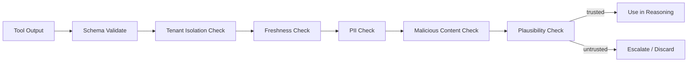

# Tool Output Trust

## Principle

Tool output is NOT automatically trusted. It must be validated, attributed, freshness-checked, and handled for malicious content before use.

## Validation Layers

| Layer | Check |
|---|---|
| Schema | Output matches expected structure |
| Type safety | Values within expected types/ranges |
| Tenant isolation | No cross-tenant data leaked |
| Source attribution | Output can be traced to provider/tool |
| Freshness | Data is not stale beyond acceptable threshold |
| Plausibility | Values are reasonable |
| PII | Sensitive data handled per policy |
| Malicious content | No executable or harmful payloads |

## Handling Malicious Web Content

- HTML/JS stripped or sandboxed.
- Downloads scanned.
- URLs validated against allowlists.
- No execution of fetched scripts.
- Suspicious content quarantined.

## Prompt Injection Through Tool Output

- Tool outputs treated as untrusted user content.
- Output delimited in prompts.
- System instructions cannot be overridden by tool output.
- Output parsed before being passed to reasoning.

## Conflicting Data

- Multiple sources may disagree.
- Confidence and freshness determine weight.
- Persistent conflicts escalated to human review.
- Conflicts recorded.

## Failure Modes

| Failure | Handling |
|---|---|
| Schema mismatch | Retry or escalate |
| Timeout | Retry per policy |
| Provider error | Fallback or DLQ |
| Empty result | Mark low confidence, re-plan |
| Stale data | Flag freshness, re-fetch |
| Malicious content | Reject, alert, quarantine |

## Tool Output Trust Flow

