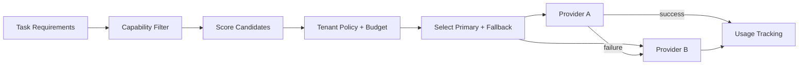

# LLM Routing

## Purpose

LLM Routing selects the most appropriate model and provider for a task without hardcoding a single provider. Routing balances capability, cost, latency, context length, reliability, privacy, risk, and quality.

## Routing Dimensions

| Dimension | Consideration |
|---|---|
| Task | Research, reasoning, generation, classification, tool use, coding |
| Complexity | Simple vs multi-step reasoning |
| Context length | Required input/output tokens |
| Latency | User-facing vs background |
| Cost | Budget per tenant/mission |
| Quality | Required accuracy for high-stakes decisions |
| Provider | Tenant restrictions, availability |
| Privacy | Data residency, provider terms |
| Risk | Fallback needs for critical actions |

## Model Registry

- ModelId
- Provider
- Capabilities (e.g., tool_use, reasoning, long_context)
- Max context
- Cost per token
- Typical latency
- Rate limits
- Trust tier
- Supported output formats

## Routing Strategies

| Strategy | Use Case |
|---|---|
| Capability match | Select model that supports required capability |
| Cost-optimized | Use cheapest adequate model for low-risk tasks |
| Quality-optimized | Use strongest model for high-stakes decisions |
| Latency-optimized | Use fastest model for interactive paths |
| Fallback | Secondary provider if primary fails |
| Tenant-mandated | Respect customer provider preferences |

## Routing Flow

1. Agent/task declares requirements.
2. Router filters capable models.
3. Scores candidates across dimensions.
4. Applies tenant policy and cost budget.
5. Selects primary and fallback.
6. Routes request.
7. Tracks latency, cost, success.
8. On failure, retries or falls back.

## Cost and Token Tracking

- Input/output tokens per request.
- Cost per tenant, mission, execution.
- Budget enforcement.
- Usage events to Billing.

## Fallback

- Exponential backoff on primary.
- Switch to secondary provider/model.
- For critical tasks, require human approval if no suitable model available.
- Degraded mode: use cached or simpler reasoning.

## LLM Routing Diagram

