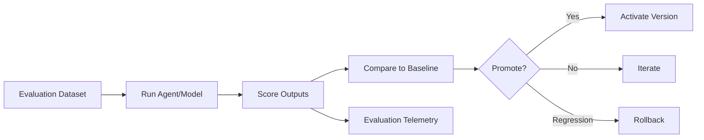

# Model Evaluation

## Purpose

Model Evaluation continuously assesses LLM/model performance on the platform's tasks. It informs routing, agent versions, prompt changes, and provider selection.

## Evaluation Dimensions

| Dimension | Metrics |
|---|---|
| Research accuracy | Correctness of extracted facts, recall of key attributes |
| ICP accuracy | Precision/recall against human-labeled ICP matches |
| Lead qualification | Precision/recall, false positive/negative rates |
| Personalization | Relevance, non-generic content, brand alignment |
| Hallucination | Rate of unsupported claims |
| Tool selection | Correct tool chosen for task |
| Decision quality | Agreement with expert labels |
| Conversation quality | Coherence, helpfulness, policy compliance |
| CRM accuracy | Correctness of mapped CRM data |
| Safety | Prompt injection resistance, policy violations |
| Cost | Tokens per task, cost per outcome |
| Latency | p50/p95 response time |

## Evaluation Datasets

- Golden datasets for each task type.
- Tenant-specific test sets (anonymized).
- Adversarial examples for safety.
- Edge cases and failure modes.
- Versioned datasets aligned with agent versions.

## Evaluation Process

1. Define task and success criteria.
2. Select or create evaluation dataset.
3. Run model/agent against dataset.
4. Score outputs using automated + human evaluation.
5. Compare against baseline.
6. Identify regressions and improvements.
7. Decide on promotion/rollback.
8. Record results.

## Human Evaluation

- Spot checks for high-stakes tasks.
- Expert review of borderline cases.
- Disagreement analysis between human and AI.
- Calibration sessions.

## Continuous Evaluation

- Shadow mode: run new version alongside current.
- Online monitoring of production outputs.
- A/B comparisons.
- Feedback loop from outcomes.

## Model Evaluation Diagram

