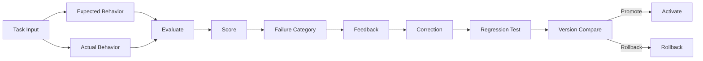

# AI Evaluation Loop

## Purpose

The AI Evaluation Loop measures actual AI behavior against expected behavior, scores it, categorizes failures, generates feedback, applies corrections, runs regression tests, compares versions, and decides promotion or rollback.

## Loop Stages

```
Input → Expected Behavior → Actual Behavior → Evaluation → Score → Failure Category → Feedback → Correction → Regression Test → Version Comparison → Promotion / Rollback
```

## Evaluation Inputs

- Task definition
- Expected output criteria
- Actual output
- Execution trace
- Tool calls
- Decisions
- Outcomes
- Human feedback (where available)

## Scoring

- Automated metrics (accuracy, relevance, safety, schema compliance)
- Business metrics (conversion, qualification, meeting rate)
- Cost metrics (tokens, latency, tool cost)
- Human ratings
- Composite score

## Failure Categories

| Category | Examples |
|---|---|
| Hallucination | Unsupported claim |
| Misclassification | Wrong intent/qualification |
| Policy violation | Disallowed action or content |
| Tool misuse | Wrong tool or inputs |
| Context failure | Missing important context |
| Reasoning error | Incorrect inference |
| Output format error | Invalid structured output |
| Safety failure | Prompt injection exploit |
| Cost overrun | Excessive tokens |

## Feedback and Correction

- For model/prompt issues: update prompt or configuration.
- For tool issues: update tool schema or adapter.
- For policy issues: adjust policy or autonomy.
- For data issues: improve knowledge/memory.
- For agent version issues: create new version.

## Regression Testing

- Re-run golden datasets after changes.
- Compare before/after scores.
- Block promotion if regressions exceed threshold.

## Promotion/Rollback

- Promotion gated by evaluation thresholds.
- Rollback triggered by regressions or production incidents.
- Feature flags enable gradual rollout.
- Human approval for high-impact changes.

## Evaluation Loop Diagram


