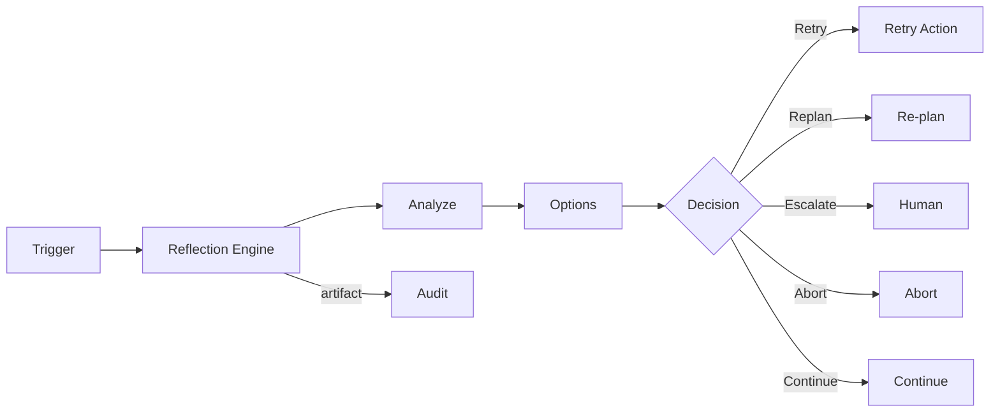

# Reflection

## Purpose

Reflection is a controlled mechanism for agents to examine execution outcomes, identify problems, and decide whether to re-plan, escalate, or adapt. It is NOT unlimited self-thinking.

## Reflection Triggers

| Trigger | When |
|---|---|
| Failure | Tool call or action failed |
| Low confidence | Decision confidence below threshold |
| Unexpected outcome | Result differs significantly from prediction |
| Contradictory evidence | New evidence conflicts with previous decision |
| Policy conflict | Proposed action violates policy |
| Mission deviation | Plan no longer aligned with objective |
| Poor evaluation | Evaluation score below threshold |
| Before high-risk action | Final sanity check |
| Human override | Human flagged issue |
| Cost anomaly | Token/tool cost exceeded budget |

## Reflection Scope

- Analyze what happened.
- Identify root cause category.
- Determine if re-planning is needed.
- Decide whether to escalate to human.
- Propose corrected approach.
- Do NOT recursively reflect without bound.

## Reflection Boundaries

- Maximum reflection depth per task.
- Time/token budget enforced.
- Reflection cannot change policy or authority.
- Reflection outputs are structured reasoning, not authoritative decisions.
- Human escalation must be possible.

## Reflection Process

1. Detect trigger.
2. Gather relevant context and evidence.
3. Generate structured analysis (what, why, options).
4. Decide: retry, re-plan, escalate, abort, continue.
5. Record reflection artifact.
6. Update mission/agent state if needed.
7. Resume within policy.

## Reflection Artifacts

- Trigger
- Analysis summary
- Root cause category
- Proposed action
- Confidence
- Policy implications
- Human escalation recommendation

## Reflection Diagram

