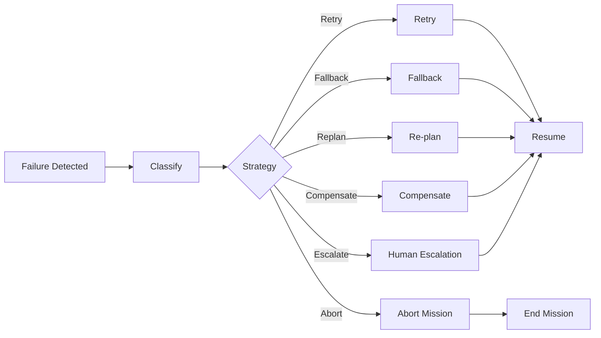

# Recovery

## Purpose

Recovery defines how the AI execution architecture responds to failures. AI will sometimes fail; the architecture must detect, contain, and recover safely without corrupting mission state.

## Failure Classes

| Failure Class | Examples |
|---|---|
| Agent failure | Crash, timeout, logic error |
| Tool failure | External API error, schema mismatch, auth failure |
| LLM failure | Provider outage, rate limit, content policy block |
| Network failure | Transient connectivity |
| External provider failure | CRM, email, calendar provider down |
| Bad output | Hallucination, malformed output, unsupported claim |
| Policy rejection | Action denied by policy |
| Timeout | Operation exceeded time budget |
| Partial completion | Some steps succeeded, others failed |
| Duplicate execution | Same work performed twice |
| Corrupted state | Inconsistent mission/execution state |

## Recovery Strategies

| Strategy | Use Case |
|---|---|
| Retry | Transient failure with idempotency |
| Fallback | LLM/tool provider alternative |
| Re-plan | Mission context changed or action failed |
| Compensate | Reverse partial external effects |
| Escalate | Human approval or review needed |
| Skip and continue | Non-critical step failure |
| Pause | Await resolution or human input |
| Abort | Mission cannot safely continue |
| Replay | Reprocess from checkpoint/event log |
| Rollback | Revert agent version or configuration |

## Recovery Process

1. Detect failure via output validation, timeouts, or provider errors.
2. Classify failure.
3. Determine safe recovery strategy.
4. Apply strategy within policy.
5. Record failure and recovery action.
6. Notify orchestrator/mission.
7. Re-plan or resume as appropriate.
8. Audit all steps.

## Mission-Level Recovery

- Workflows resume from last checkpoint.
- Mission Orchestrator decides retry/re-plan/abort.
- Partial external effects compensated or flagged for human review.
- Persistent failures move mission to Blocked or Failed state.

## Agent-Level Recovery

- AgentExecutor retries idempotent tasks.
- Falls back to alternate model/provider.
- Escalates low-confidence or policy-blocked actions.
- Does not silently ignore failures.

## Compensation

- Cancel booked meeting if opportunity creation fails.
- Suppress follow-up if prospect opts out.
- Revert CRM update if sync conflict unresolved.
- Compensation actions are themselves subject to policy and audit.

## Recovery Architecture Diagram

