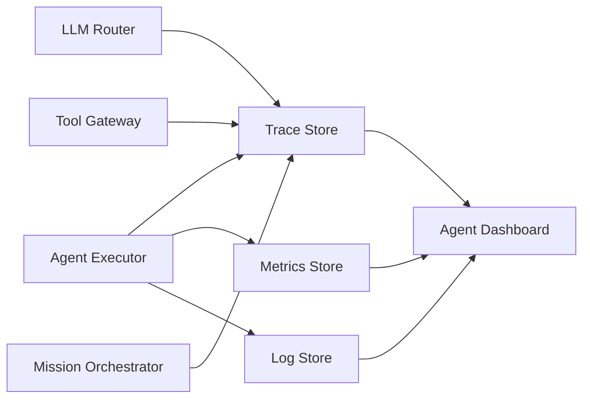

# Agent Observability

## Purpose

Every AI execution must be traceable from tenant and mission down to individual tool calls. Observability includes logs, metrics, traces, and structured telemetry.

## Correlation Model

| ID | Scope |
|---|---|
| TenantId | Tenant |
| UserId / AgentId | Actor |
| MissionId | Business mission |
| ExecutionId | Agent execution run |
| TaskId | Task within execution |
| ToolId | Tool invocation |
| DecisionId | AI decision |
| PolicyCheckId | Policy evaluation |
| ApprovalId | Human approval request |
| EventId | Domain/integration event |
| ModelId / PromptVersion | AI model/prompt used |

## Telemetry Types

| Type | Examples |
|---|---|
| Execution telemetry | Start/end, status, duration |
| Model telemetry | Model used, tokens, latency, cost, fallback |
| Tool telemetry | Tool name, inputs/outputs, latency, success |
| Decision telemetry | Decision type, confidence, policy result |
| Policy telemetry | Checks, denials, approvals |
| Cost telemetry | Tokens, API calls, compute time |
| Outcome telemetry | Mission outcome, conversion, revenue attribution |
| Human intervention telemetry | Approval count, wait time, override rate |

## Tracing

- Distributed trace spans API Gateway → Mission Orchestrator → Agent Executor → LLM → Tool Gateway → External providers.
- Each span carries correlation IDs.
- AI-specific spans: context assembly, reasoning, output validation.
- Traces linked to audit records and decision records.

## Metrics

- Agent executions per minute
- Success/failure/approval-required rates
- Token usage and cost per tenant/mission
- LLM latency p50/p95/p99
- Tool success rate by provider
- Mission completion rate
- Human intervention rate
- Policy denial rate

## Logging

- Structured JSON logs.
- Severity levels.
- Sanitized inputs/outputs.
- No secrets or PII.
- Tenant and mission context.

## Agent Observability Diagram

## End-to-End Mission Trace

A complete mission trace includes all related executions, decisions, policy checks, approvals, tool calls, external actions, and outcomes, accessible by MissionId.
