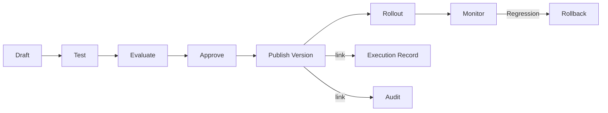

# Prompt and Policy Versioning

## Purpose

Every AI action must be attributable to a specific version of prompts, policies, agent instructions, tool definitions, evaluation criteria, routing policies, and knowledge configuration.

## Versioned Artifacts

| Artifact | Versioned? | Owner |
|---|---|---|
| System prompts | Yes | Platform team |
| Agent instructions | Yes | AI governance / domain team |
| Tool definitions | Yes | Integration / AI governance |
| Policies | Yes | Compliance / tenant admin |
| Evaluation criteria | Yes | AI evaluation team |
| Routing policies | Yes | AI operations |
| Knowledge configuration | Yes | Tenant admin / curation |
| Prompt templates | Yes | Domain / content team |

## Versioning Model

- Semantic versioning (major/minor/patch).
- Major: behavior or policy change.
- Minor: improvements, new examples, clarifications.
- Patch: typo/formatting/non-behavioral fixes.
- Immutable once published for active use.

## Attribution

- Every execution record references prompt version, policy version, agent version, and model config.
- Evaluation results linked to artifact versions.
- Audit records include version references.
- A/B comparisons require version isolation.

## Promotion Path

1. Draft / edit artifact.
2. Test in sandbox/evaluation environment.
3. Evaluate against golden datasets.
4. Review and approve (human for high-risk).
5. Publish immutable version.
6. Roll out via feature flags.
7. Monitor metrics and outcomes.
8. Roll back if regression.

## Rollback

- Revert to last approved version.
- Rollback does not alter historical executions.
- New executions use previous version.
- Triggered by regression, incident, or policy change.

## Policy Versioning

- Policy changes create new versions.
- Active policies immutable.
- Effective policy determined by tenant, mission, agent versions.
- Policy precedence rules resolve conflicts.

## Prompt / Policy Versioning Diagram

