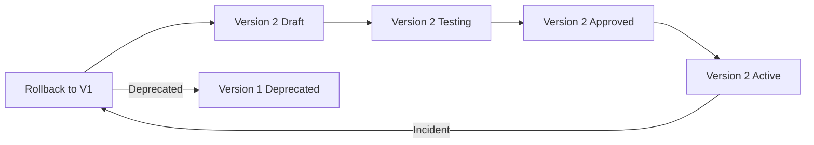

# Agent Versioning

## Purpose

Agent Versioning controls how agent definitions, capabilities, and configurations evolve, ensuring reproducibility, evaluation, rollback, and auditability.

## Version States

| State | Meaning |
|---|---|
| Draft | Under development |
| Testing | Under evaluation |
| Approved | Cleared for activation |
| Active | Currently used by new executions |
| Deprecated | No longer recommended |
| Retired | Cannot be used |

## Versioning Rules

- Each material change creates a new version.
- Published versions are immutable.
- Executions reference the version used.
- Rollback to previous approved version supported.
- Major version for capability or policy changes.
- Minor version for prompt/config/behavior improvements.
- Patch version for non-behavioral fixes.

## Version Promotion

1. Create new draft from current version.
2. Modify capabilities, tools, instructions, or model config.
3. Test in isolated environment.
4. Evaluate against criteria.
5. Approve (human for high-risk agents).
6. Publish version.
7. Activate via feature flag.
8. Monitor.

## Version Compatibility

- New version must be backward-compatible in interfaces if used by in-flight missions.
- Breaking changes require new major version and migration.
- Tool schemas must remain compatible across minor versions.

## Version Audit

- Who created, approved, activated, deprecated, retired.
- Evaluation results per version.
- Executions using each version.
- Rollback history.

## Agent Versioning Diagram

