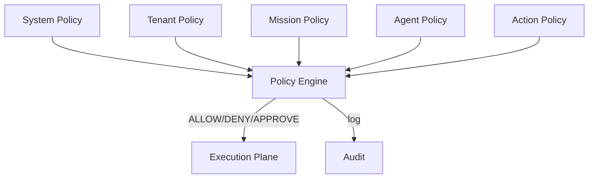

# AI Governance

## Purpose

AI Governance defines the policy hierarchy, enforcement mechanisms, conflict resolution, emergency override, and audit for AI behavior.

## Policy Hierarchy

1. **System Policy** — platform-wide safety, legal, security minimums.
2. **Tenant Policy** — customer-defined rules and constraints.
3. **Mission Policy** — mission-specific rules.
4. **Agent Policy** — agent-specific constraints.
5. **Action Policy** — fine-grained rules per action type.

Lower-numbered policies override higher-numbered ones when conflicts cannot be reconciled.

## Governance Components

| Component | Responsibility |
|---|---|
| Policy Registry | Store and version policies |
| Policy Engine | Evaluate policies against action context |
| Autonomy Service | Map policy and risk to autonomy decision |
| Capability Registry | Define what agents can do |
| Approval Service | Manage human approvals |
| Feature Flags | Control rollout of capabilities |
| Emergency Stop | Halt agents/missions/tenants |
| Audit Integration | Log governance decisions |

## Conflict Resolution

- System policies cannot be overridden by tenant/mission/agent policies.
- Tenant policy cannot override system safety policy.
- Mission policy narrows within tenant policy.
- Agent policy further narrows within mission policy.
- Conflicts log warning and escalate if unresolved.

## Emergency Override

- Platform or compliance admin can suspend tenant, mission, or agent.
- Emergency stop propagates via events.
- In-flight actions cancelled or paused.
- All emergency actions audited.
- Recovery requires explicit re-enable.

## Policy Enforcement

- Synchronous policy queries for action authorization.
- Asynchronous policy compliance checks for outputs.
- Denials and approvals logged.
- Policy evaluation is itself auditable.

## AI Governance Diagram

