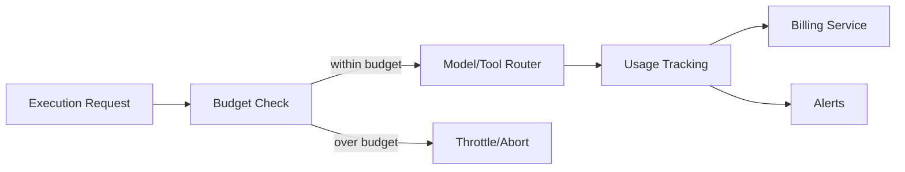

# AI Cost Governance

## Purpose

Cost Governance prevents runaway token, tool, and compute usage while attributing costs to tenants, missions, agents, and actions.

## Budget Types

| Budget Type | Scope |
|---|---|
| Tenant budget | Total monthly AI spend per tenant |
| Mission budget | Spend cap per mission |
| Agent budget | Spend cap per agent/version evaluation |
| Model budget | Allocation per model/provider |
| Tool budget | Spend per tool/provider |
| User budget | Optional per-user limits |

## Cost Tracking

- Tokens (input/output) per LLM call.
- Cost per token per model/provider.
- Tool/API call costs.
- Compute costs for agent execution.
- Attribution by tenant, mission, execution, agent, task.

## Cost Controls

| Control | Description |
|---|---|
| Quotas | Hard limits per period |
| Throttling | Slow execution when approaching budget |
| Model routing | Use cheaper models where quality sufficient |
| Context compression | Reduce token usage |
| Caching | Cache deterministic prompts/results |
| Batch processing | Group research/outreach tasks |
| Runaway detection | Alert/abort on anomalous spend |

## Cost Alerts

- 50%, 75%, 90%, 100% of budget.
- Anomaly detection for unusual spikes.
- Per-tenant dashboards.
- Automated throttling or pause at limits.

## Cost Telemetry

- Real-time cost stream to Billing.
- Historical cost analytics.
- Cost per outcome (cost per qualified lead, cost per meeting).
- Budget vs actual reports.

## Cost Governance Flow

