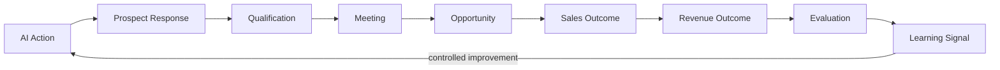

# Revenue Outcome Loop

## Purpose

The Revenue Outcome Loop connects AI actions to real business outcomes. It tracks prospect responses, qualification, meetings, opportunities, sales outcomes, and revenue, then feeds evaluation and learning.

## Outcome Chain

```
AI Action
→ Prospect Response
→ Qualification
→ Meeting
→ Opportunity
→ Sales Outcome
→ Revenue Outcome
→ Evaluation
→ Learning Signal
```

## Outcome Events

| Event | Meaning |
|---|---|
| OutreachSent | AI sent message |
| ProspectReplied | Prospect responded |
| LeadQualified | Lead deemed qualified |
| MeetingBooked | Meeting scheduled |
| OpportunityCreated | Opportunity in CRM |
| OpportunityWon | Deal closed won |
| OpportunityLost | Deal closed lost |
| RevenueAttributed | Revenue linked to AI action |
| LearningSignalGenerated | Feedback for AI improvement |

## Attribution

- First-touch attribution: AI initiated the sequence.
- Last-touch attribution: AI action immediately preceded conversion.
- Multi-touch influence: AI actions contributed along the journey.
- Attribution model is configurable per tenant.
- Avoid overclaiming; use conservative attribution where uncertainty exists.

## Evaluation

- Compare AI-assisted sequences vs baseline.
- Measure conversion at each stage.
- Identify which actions/strategies correlate with positive outcomes.
- Detect negative outcomes (unsubscribes, complaints, lost deals).
- Correlate agent versions, prompts, models with outcomes.

## Learning Signal

- Positive: high-conversion actions reinforce successful patterns.
- Negative: low-quality outreach or misqualification triggers correction.
- Signal stored in Outcome Memory / Analytics.
- Used in evaluation loops and experimentation.
- No autonomous retraining; changes go through governance.

## Revenue Outcome Loop Diagram



## Privacy and Ethics

- Attribution must not expose prospect PII.
- Revenue data used only per tenant policy and compliance.
- Avoid manipulative optimization targets.
