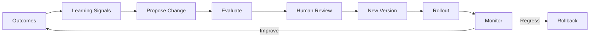

# Learning Architecture

## Purpose

Learning Architecture defines controlled mechanisms for improving AI behavior from outcomes without allowing uncontrolled autonomous retraining.

## Types of Learning

| Type | Description | Mechanism |
|---|---|---|
| Runtime adaptation | In-context adjustments within policy | Prompt, context, plan updates |
| Configuration improvement | Agent/prompt/policy tuning | Governance-approved updates |
| Prompt improvement | Better instructions/examples | Evaluation + A/B testing |
| Policy improvement | Better rules/constraints | Human-reviewed policy changes |
| Agent improvement | New capabilities or versions | Testing, evaluation, rollout |
| Model improvement | Switch/routing/fine-tuning | Evaluation, provider selection |
| Fine-tuning | Model-specific training | Explicit, governed, with data governance |

## No Uncontrolled Autonomous Retraining

- The system does not automatically retrain models based on runtime data.
- Learning signals are reviewed before incorporation.
- Prompt/agent changes go through versioning and evaluation.
- Model fine-tuning is a deliberate, governed activity.

## Learning Loop

1. Collect outcomes and feedback.
2. Generate learning signals.
3. Propose configuration/prompt/policy/agent changes.
4. Evaluate change in sandbox with golden datasets.
5. Human review for high-impact changes.
6. Publish new version.
7. Roll out via feature flags.
8. Monitor for regression or improvement.

## Learning Data

- Outcome events.
- Human feedback (approvals, rejections, corrections).
- Evaluation scores.
- Cost and conversion data.
- Anonymized where required.
- Tenant-scoped; no cross-tenant training data sharing.

## Learning Architecture Diagram

