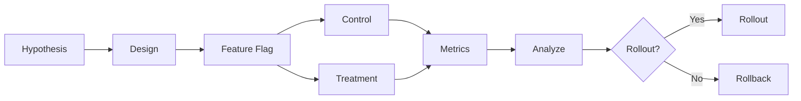

# Experimentation

## Purpose

Experimentation supports controlled comparison of agents, prompts, models, tools, strategies, and workflows. It requires statistical confidence where applicable and safe rollback.

## Experiment Types

| Type | Example |
|---|---|
| Agent variant | Research Agent v2.1 vs v2.2 |
| Prompt variant | Two outreach prompts |
| Model variant | GPT-4 vs Claude 3.5 |
| Strategy variant | Two outreach cadences |
| Workflow variant | Different approval thresholds |
| Tool variant | Two research providers |

## Experiment Design

- Hypothesis
- Success metric(s)
- Control and treatment groups
- Randomization unit (tenant, mission, prospect, conversation)
- Minimum sample size / duration
- Statistical confidence target where feasible
- Guardrails and kill criteria
- Rollback plan

## Guardrails

- Experiments cannot bypass policy or security.
- High-risk experiments require human approval.
- No cross-tenant contamination.
- No PII leakage.
- Feature flags isolate experiment exposure.
- Emergency stop applies.

## Rollback

- Automatic rollback on safety/regression signals.
- Manual rollback by disabling feature flag.
- Rollback does not affect historical experiment data.

## Evaluation

- Compare metrics against control.
- Compute confidence intervals where possible.
- Report business outcomes, not just engagement metrics.
- Document conclusions and decisions.

## Experimentation Diagram

