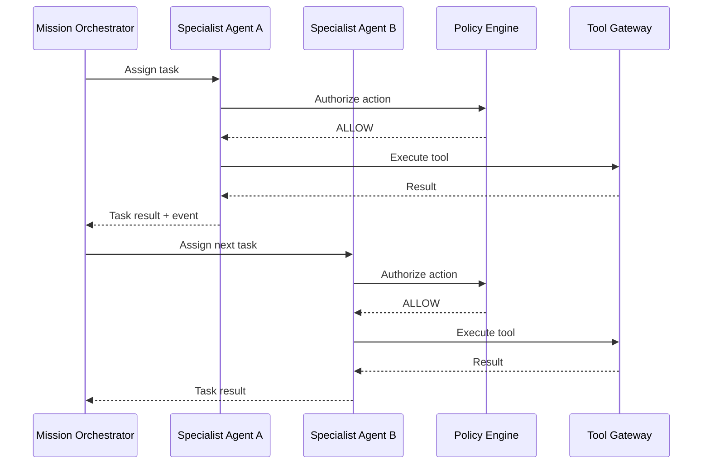

# Multi-Agent Communication

## Purpose

If multiple agents are used, their communication must be bounded, secure, traceable, and resilient. Uncontrolled agent-to-agent conversations are forbidden.

## Communication Patterns

| Pattern | Use Case |
|---|---|
| Orchestrator delegation | Mission Orchestrator assigns tasks to agents |
| Event-driven handoff | Agent emits event; next agent consumes it |
| Request-response | Agent queries another agent for context |
| Shared state via persistence | Agents read/write mission/execution state via owned stores |

## Message Format

- Sender agent ID and version
- Recipient agent/role
- Tenant ID and mission ID
- Task definition
- Required input context
- Expected output
- Timeout
- Correlation ID
- Authorization token/context

## Boundaries

- Agents cannot grant capabilities to each other.
- Agents cannot bypass Policy Engine or Tool Gateway.
- Agents cannot access another tenant's data.
- Agents cannot modify mission objectives.
- Communication is observable and auditable.

## Discovery

- Agent registry lists available agents and capabilities.
- Orchestrator selects agents based on task and capability.
- Dynamic agent discovery allowed but governed by registry.

## Failure Handling

- Timeout and retry for inter-agent requests.
- Fallback agent selection if one fails.
- Escalate if no agent can complete task.
- Isolated failure does not crash other agents.

## Security

- Authenticated agent identities.
- Tenant-scoped messages.
- No secrets in messages.
- Messages logged for audit (sanitized).

## Multi-Agent Communication Diagram

