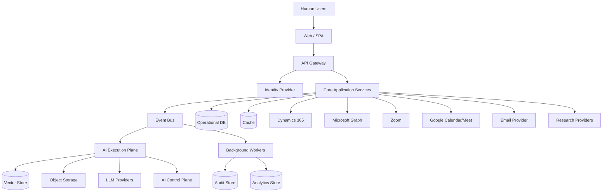

# System Architecture Overview

## Scope

This document describes the enterprise / system architecture for the AI-Native Autonomous Revenue Employee. It transforms the approved product vision, ADRs, business architecture, and domain model into a production-grade technical architecture without prescribing implementation code.

## Architectural Style

The system is designed as an **AI-native, event-driven, domain-aligned modular architecture**:

- **Domain-Driven Design (DDD)** guides bounded context and aggregate boundaries.
- **Modular Monolith** is the initial runtime style for most business contexts, with independent worker pools for AI execution, background processing, and integrations.
- **Event-Driven Architecture** enables asynchronous, decoupled communication between contexts.
- **API-First** ensures internal and external interfaces are contract-driven.
- **Agent-Oriented Architecture** treats AI agents as first-class runtime actors with explicit control and execution planes.

## Why Not Microservices from Day One

Microservices introduce operational complexity before scale is proven. The initial modular monolith keeps domain boundaries explicit while allowing extraction into independently deployable services once a context needs independent scaling or failure isolation. The architecture is designed so that extraction does not require domain rewrites.

## Core Architectural Principles

1. **AI is first-class but controlled**: Agents have identity, authority, and audit; they never bypass policy or security.
2. **Domain logic is independent of infrastructure**: Domain layers do not depend on HTTP, database SDKs, cloud SDKs, CRM SDKs, or LLM SDKs.
3. **Provider neutrality**: Microsoft Dynamics 365, Zoom, email, calendar, and LLM providers are isolated behind adapters.
4. **Tenant isolation by design**: Every tenant-scoped operation carries explicit tenant context; cross-tenant access is impossible by default.
5. **Durable execution**: Missions can run for seconds to weeks; state is persisted and resumeable.
6. **Observable end-to-end**: Every mission, agent execution, and external action is traceable.
7. **Defensive against AI-specific threats**: Prompt injection, tool poisoning, and privilege escalation are addressed architecturally.

## Reference Architecture

## Key Runtime Concerns

- **API Gateway**: authentication, tenant routing, rate limiting, external API exposure
- **Core Application Services**: modular services aligned to bounded contexts
- **AI Control Plane**: policy, autonomy, approval, governance
- **AI Execution Plane**: agent runtime, task execution, LLM gateway, tool execution
- **Event Bus**: durable event transport, topics, queues
- **Background Workers**: durable mission execution, CRM sync, analytics projection
- **Data Stores**: operational DB, vector store, cache, object storage, audit store, analytics store

## Authoritative Sources

- `/docs/adr/`
- `/docs/business/`
- `/docs/domain/`
- Product Constitution (currently missing; tracked as dependency)
