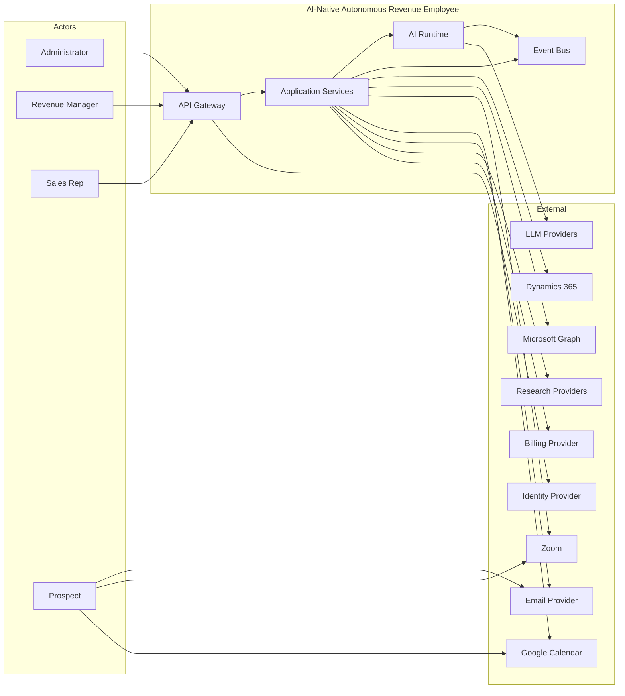

# System Context

## Actors

| Actor | Role | Primary Interactions |
|---|---|---|
| Platform Administrator | Manages platform-level configuration, security, integrations | Tenant provisioning, global settings, monitoring |
| Customer Administrator | Manages a tenant's configuration and users | Tenant setup, billing, integrations, policies |
| Revenue Manager | Creates missions and monitors outcomes | Mission lifecycle, ICP, approvals, performance |
| Sales Manager | Reviews pipeline and meetings | Contacts, meetings, opportunities, team performance |
| Sales Representative | Engages qualified prospects and records outcomes | Meeting briefs, CRM updates, feedback |
| AI Agent | Executes tasks within policies | Research, outreach, conversation, scheduling |
| Prospect | Target of outreach and meetings | Receives messages, replies, schedules meetings |
| Customer | The paying organization represented by a tenant | Configures the AI employee |

## External Systems

| External System | Purpose | Trust Boundary | Direction | Failure Modes |
|---|---|---|---|---|
| Microsoft Dynamics 365 | CRM/ERP target for opportunities | External SaaS | Bidirectional sync | API limits, auth expiry, schema changes |
| Microsoft Graph | Email, calendar access | External SaaS | Bidirectional | Auth expiry, throttling |
| Google Calendar / Meet | Alternative meeting provider | External SaaS | Bidirectional | Auth expiry, quota |
| Zoom | Meeting provider | External SaaS | Bidirectional | Rate limits, auth expiry |
| Email Providers | Outbound/inbound email transport | External network | Outbound + inbound (webhooks) | Bounces, blocks, provider outage |
| LinkedIn / messaging providers | Social outreach | External SaaS | Outbound + inbound (where API allows) | Account restrictions |
| Web Search / Research Providers | Company/signal intelligence | External network | Outbound | Rate limits, data quality, availability |
| LLM Providers | Model inference | External API | Outbound | Rate limits, latency, content policy, outage |
| Identity Provider | Authentication | External identity boundary | Inbound claims | Auth failure, token expiry |
| Billing Provider | Payment/invoicing | External SaaS | Outbound events | Provider outage, reconciliation issues |
| Object Storage | File/archive storage | Cloud boundary | Outbound | Latency, availability |

## Data Exchange

- **Inbound from external**: webhooks (email replies, calendar updates, CRM changes), OAuth callbacks, API responses.
- **Outbound to external**: API calls to CRM, calendar, email, LLM, search, billing.
- **Cross-boundary rules**: All external calls use tenant-scoped credentials; no raw external IDs enter core domain; all failures are retried, logged, and surfaced as domain events.

## Security Requirements

- mTLS or HTTPS for all external communication.
- OAuth2/OIDC for identity; OAuth2 / service principals for external integrations.
- Secrets stored in a dedicated secrets manager; never in code or config.
- Webhook signatures validated.
- External data sanitized and validated before entering domain.

## Availability Dependencies

- The platform can degrade if external providers fail: CRM sync may lag, email delivery may retry, meetings may require manual booking.
- Core mission state and AI reasoning must not depend on real-time external availability.
- LLM provider failure must trigger fallback or graceful degradation.

## System Context Diagram

