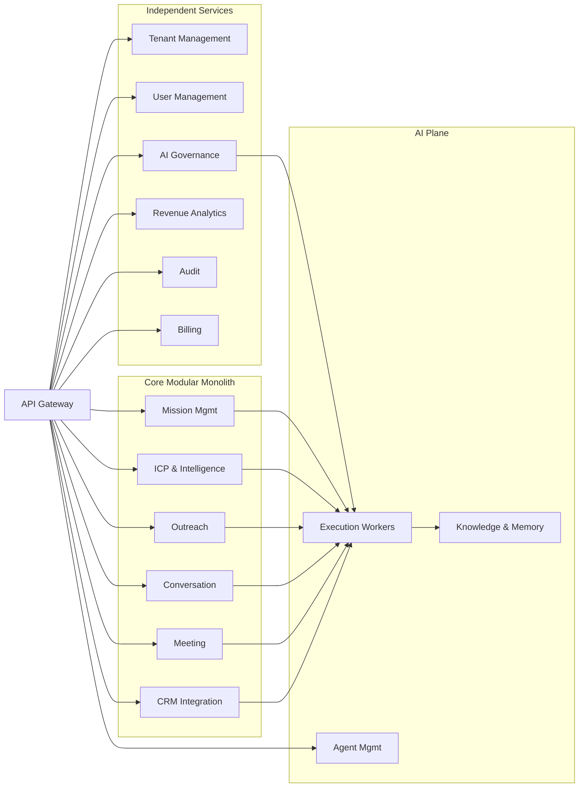

# Service Boundaries

## Service Boundary Decisions

| Bounded Context | Runtime Service(s) | Boundary Type | Reasoning |
|---|---|---|---|
| Tenant & Organization Management | Tenant Management Service | Independent service | Tenant lifecycle is cross-cutting and requires strict isolation |
| User & Identity Management | User Management Service / Identity Provider adapter | Independent service | Auth concerns, external IdP integration |
| Revenue Mission Management | Mission Management Service | Core module | Central revenue orchestration; may extract later |
| ICP & Market Strategy | ICP & Intelligence Service | Core module | Heavy research workloads may scale independently |
| Company Intelligence | ICP & Intelligence Service | Shared runtime | Tight data coupling with ICP and research |
| Contact Intelligence | ICP & Intelligence Service | Shared runtime | Tight data coupling with company intelligence |
| Lead & Qualification Management | Mission Management Service / Lead Service | Core module | May be promoted to independent service |
| Buying Signal Intelligence | ICP & Intelligence Service | Shared runtime | Research-driven; shares data with intelligence |
| Opportunity Management | Mission Management Service | Core module | Part of revenue pipeline |
| Outreach & Communication | Outreach Service | Core module | High-volume messaging; may scale independently |
| Conversation Management | Conversation Service | Core module | Manages long-lived dialogue state |
| Meeting & Scheduling | Meeting Service | Core module | Calendar integration workload |
| CRM Synchronization | CRM Integration Service | Independent-ish module | External integration heavy; may be a service |
| Revenue Analytics | Revenue Analytics Service | Independent service | Read-only projections; independent scaling |
| AI Agent Management | Agent Management Service + AI Execution Workers | Separate plane | Operational AI execution must be isolated |
| Knowledge Management | Knowledge & Memory Service | Shared runtime with AI plane | Retrieval-heavy, co-located with AI execution |
| AI Governance & Policy | AI Governance Service | Independent service | Safety-critical; separated from execution |
| Billing & Subscription | Billing Service | Independent service | Commercial separation |
| Compliance & Consent | AI Governance Service + Compliance module | Shared runtime | Policies and consent are governance concerns |
| Audit & Governance | Audit Service + Audit ingestion workers | Independent service | Immutable log; append-only workload |

## Independent Runtime Boundaries

- **Tenant Management**: separate because tenant onboarding/suspension affects all modules.
- **AI Execution Plane**: separate to scale GPU/LLM/token-heavy workloads independently from business logic.
- **AI Governance**: separate to enforce policy even when execution plane is under load.
- **Revenue Analytics**: separate because it is read-only and consumes events; failures should not affect transactions.
- **Audit**: separate to protect immutability and allow compliance auditing.
- **CRM Integration**: separate because external CRM connectivity is failure-prone and rate-limited.

## Shared Runtime Boundaries

- **Core Application Modules** share a modular monolith in the initial stage to reduce operational complexity while preserving domain boundaries. Modules communicate via events or in-process calls but do not bypass each other's aggregates.
- **ICP & Intelligence modules** share a runtime because they operate on overlapping data and research pipelines.
- **Compliance & Consent** shares governance runtime for policy enforcement.

## Extraction Path

Any shared-runtime module can be extracted into an independent service if it:

- Requires independent scaling
- Has different availability requirements
- Needs separate deployment cadence
- Must fail independently
- Needs a different technology stack

Extraction should not require changes to domain models or contracts.

## Service Boundary Diagram

