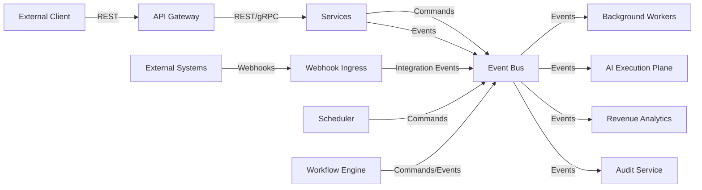

# Communication Architecture

## Communication Patterns

| Pattern | Use Case | Technology Examples | Guarantees |
|---|---|---|---|
| Synchronous REST/HTTP | User-facing queries, approvals, configuration | API Gateway → Services | Request/response, timeouts |
| Synchronous gRPC/HTTP2 | Internal high-performance service calls | Service mesh | Request/response |
| Asynchronous Commands | Trigger actions across contexts | Event Bus queue | At-least-once delivery |
| Domain Events | Notify business facts | Event Bus topic | At-least-once, idempotent consumers |
| Integration Events | Sync with external systems | Event Bus + Integration Gateway | At-least-once, retry |
| Webhooks | Inbound external events | API Gateway → Services | Signature validation required |
| Scheduled Execution | Delayed/recurring tasks | Scheduler + Workflow Engine | Best-effort; retries |
| Long-running Workflows | Missions, multi-step approvals | Workflow Engine + Events | Durable, checkpointed |
| Agent-to-Agent | Task delegation within AI plane | Internal message bus / events | At-least-once |
| Queries | Read model access | API or event projections | Eventually consistent |

## When to Use Each Pattern

- **REST/HTTP**: External clients, synchronous reads/writes where immediate confirmation is needed.
- **Commands**: When one service needs another to perform an action (e.g., Mission requests AI execution).
- **Domain Events**: When a business fact has occurred and multiple consumers may react (e.g., MissionApproved).
- **Integration Events**: When translating between external system events and domain events (e.g., Dynamics webhook).
- **Scheduled Execution**: For follow-ups, retries, research refresh, and periodic jobs.
- **Long-running Workflows**: For missions that span hours/days and require human approvals.

## REST/HTTP Guidelines

- API-first design with OpenAPI contracts.
- Tenant identity in header or claim.
- Idempotency keys for mutation endpoints.
- Standard error envelope with trace/correlation IDs.
- Rate limiting per tenant and per user.
- Authentication via OIDC bearer tokens.

## Asynchronous Command Guidelines

- Commands are named as business intentions (e.g., `ExecuteTask`).
- Commands carry correlation ID, tenant ID, and actor identity.
- Command handlers validate authorization and policy before execution.
- Failed commands produce failure events or dead-letter messages.

## Domain Event Guidelines

- Events are immutable and versioned.
- Event names reflect business facts (e.g., `LeadQualified`).
- Events include producer context, tenant ID, and timestamp.
- Consumers must be idempotent.
- Event ordering is not guaranteed globally; consumers handle out-of-order events via state checks.

## Webhook Guidelines

- Webhooks enter through a dedicated webhook ingress.
- Signatures verified before processing.
- Webhook payloads are mapped to integration events by an anti-corruption layer.
- Webhook handlers are stateless and return quickly; heavy processing is offloaded to events.

## Communication Diagram

## Anti-Patterns to Avoid

- Do not use synchronous calls across services for long-running operations.
- Do not expose internal domain events directly to external consumers.
- Do not depend on global event ordering.
- Do not allow external webhooks to bypass anti-corruption layers.
