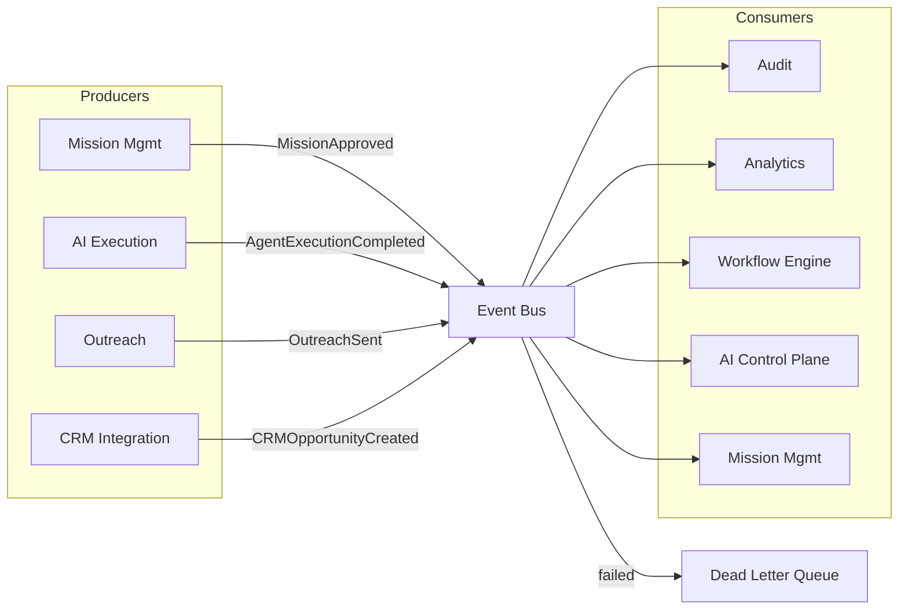

# Event Architecture

## Event Bus Responsibilities

The event bus is the central nervous system for asynchronous communication. It provides:

- Durable message transport
- Topic-based pub/sub
- Queue-based point-to-point commands
- Delayed/scheduled messages
- Dead-letter queues (DLQ)
- Replay capability
- Backpressure handling

## Topics and Queues

| Channel | Type | Purpose |
|---|---|---|
| domain.events | Topic | All business domain events |
| mission.commands | Queue | Commands targeting Mission Management |
| agent.commands | Queue | Commands targeting AI Execution Workers |
| agent.events | Topic | Agent execution lifecycle events |
| outreach.commands | Queue | Outreach commands |
| conversation.commands | Queue | Conversation commands |
| meeting.commands | Queue | Meeting commands |
| crm.commands | Queue | CRM sync commands |
| crm.events | Topic | CRM sync outcomes |
| audit.events | Topic | Audit records |
| analytics.events | Topic | Analytics projections |
| integration.events | Topic | External system events |
| scheduler.commands | Queue | Scheduled/delayed commands |
| dlq | Queue | Dead-letter messages |

## Producer Ownership

- Each service owns the events it produces.
- Producers define event schema and versioning.
- Producers do not know consumers.

## Consumer Ownership

- Each consumer maintains its own subscription.
- Consumers are responsible for idempotency.
- Consumers should not assume event ordering.

## Retry Policy

| Failure Type | Retry Strategy | Max Attempts | Backoff |
|---|---|---|---|
| Transient network error | Exponential backoff | 5 | 1s, 2s, 4s, 8s, 16s |
| External provider throttling | Exponential backoff + jitter | 10 | 5s base |
| Validation error | No retry; dead-letter | 0 | - |
| Business rule violation | No retry; emit failure event | 0 | - |
| Timeout | Retry with backoff | 3 | 2s |

## Dead Letter Queue

- Messages that fail all retries are moved to DLQ.
- DLQ consumers alert operations and support replay.
- Each service owns its DLQ inspection and replay tooling.

## Ordering

- Event ordering is not guaranteed globally.
- Consumers use event versions and aggregate state to handle out-of-order events.
- Where ordering matters, use aggregate-specific sequential processing or saga patterns.

## Idempotency

- Every event carries an event ID.
- Consumers track processed event IDs per aggregate.
- Commands carry idempotency keys.
- Idempotency stores use TTL to limit storage growth.

## Deduplication

- Duplicate events are detected by event ID.
- Long-running workflows deduplicate by workflow instance ID.
- External webhooks deduplicate by provider-specific ID.

## Event Versioning

- Events are versioned (e.g., `LeadQualified.v1`, `LeadQualified.v2`).
- Producers support multiple versions during migration windows.
- Consumers declare compatible versions.
- Breaking changes require new event types when necessary.

## Replay

- Events are retained in an event store or log for replay.
- Replay is used for analytics rebuilding, debugging, and disaster recovery.
- Replay must not trigger side effects such as external messages; consumers should detect replay mode.

## Backpressure

- Slow consumers trigger scaling or throttling.
- Event bus supports consumer lag monitoring.
- Producers reduce rate or use circuit breakers when consumers are overwhelmed.

## Poison Messages

- Malformed or unprocessable events are moved to DLQ after a small number of attempts.
- Poison message handling includes alerting and manual inspection.

## Recovery

- On service restart, consumers resume from last checkpoint.
- Checkpoints are committed after successful processing.
- In-flight events are reprocessed at-least-once.

## Event Architecture Diagram

