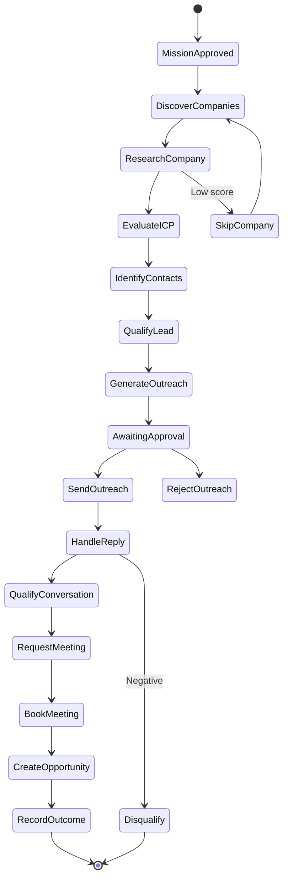

# Workflow Architecture

## Workflow Engine Responsibilities

The workflow engine manages long-running, stateful business processes that span multiple services, human approvals, timers, and external callbacks. Key responsibilities:

- Durable execution state
- Checkpointing
- Pause and resume
- Cancellation and compensation
- Timer and delayed action scheduling
- Human approval tasks
- External event correlation
- Retry and timeout handling

## Workflows vs Domain Events

| Concern | Workflow Engine | Event Bus |
|---|---|---|
| Orchestration | Coordinates multi-step processes | Decouples producers and consumers |
| State | Maintains workflow instance state | Stateless message transport |
| Human tasks | Supports approval tasks | No task semantics |
| Timers | Supports durable timers | May support delayed messages |
| Coupling | Knows participants | Participants are independent |

## Key Workflows

### Mission Execution Workflow

- Trigger: MissionApproved event
- Steps:
  1. Initialize mission context
  2. Discover companies (loop until target or budget)
  3. Research and score each company
  4. Identify contacts
  5. Qualify leads
  6. Generate and approve outreach (may pause for human)
  7. Handle replies
  8. Qualify conversations
  9. Schedule meetings
  10. Create opportunities
  11. Record outcomes and evaluate
- Supports pause, resume, cancellation
- Retries per step with compensation

### Outreach Approval Workflow

- Trigger: OutreachGenerated event + policy requires approval
- Steps:
  1. Create approval task
  2. Wait for human decision or timeout
  3. Route to send or reject
  4. Record audit

### Meeting Scheduling Workflow

- Trigger: MeetingRequested command
- Steps:
  1. Query availability across calendars
  2. Propose times to prospect
  3. Wait for selection or timeout
  4. Book meeting
  5. Emit MeetingBooked event

### CRM Sync Workflow

- Trigger: Opportunity/Meeting created or updated
- Steps:
  1. Map domain object to CRM entity
  2. Attempt sync with retry
  3. On persistent failure, alert and DLQ

## Checkpointing

- Workflow state is persisted after each significant step.
- Checkpoints include current step, variables, and pending events.
- On failure, workflow resumes from last checkpoint.

## Compensation

- Compensating actions reverse partial work.
- Examples:
  - If a meeting is booked but opportunity creation fails, workflow may cancel the meeting or create a manual task.
  - If outreach is sent but lead is disqualified, workflow records outcome and suppresses further outreach.

## Timeouts

- Human approval tasks have configurable timeouts.
- External callbacks have timeouts with fallback.
- Step-level timeouts prevent stuck workflows.

## External Event Correlation

- Workflow waits for external events using correlation IDs.
- Examples: email reply webhook, calendar confirmation, CRM webhook.

## Workflow State Storage

- Workflow state stored in operational database or dedicated workflow store.
- State encrypted at rest.
- Tenant ID is part of workflow instance identity.

## Workflow Security

- Workflow execution respects tenant isolation.
- Workflow actions are authorized.
- Workflow history is part of audit trail.

## Workflow Diagram

