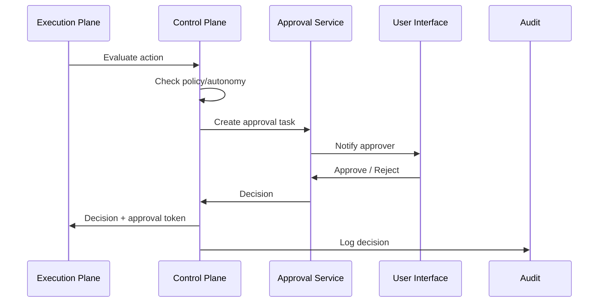

# AI Control Plane

## Purpose

The AI Control Plane governs all AI activity. It defines what agents are allowed to do, evaluates policies, enforces autonomy levels, manages approvals, and can shut down agents or missions in emergencies.

## Components

| Component | Responsibility |
|---|---|
| Agent Registry | Stores agent definitions, roles, capabilities, versions |
| Policy Engine | Evaluates tenant policies and autonomy rules |
| Approval Service | Manages approval requests, grants, rejections, and escalation |
| Autonomy Service | Determines if an action may run autonomously |
| Capability Registry | Defines what tools and actions each capability permits |
| Model Registry | Tracks supported models, providers, and capabilities |
| Feature Flag Service | Controls rollout of agents, models, tools, and autonomy levels |
| Emergency Stop | Provides ability to suspend agents/missions/tenants |
| Audit Integration | Records all control-plane decisions |

## Control Plane Responsibilities

- Define and version policies
- Assign capabilities to agents
- Set per-tenant and per-mission autonomy levels
- Evaluate whether an action requires approval
- Route approval requests to appropriate humans
- Enforce emergency shutdown
- Validate model/tool eligibility
- Emit governance events

## Control Plane vs Execution Plane

| Control Plane | Execution Plane |
|---|---|
| Decides if an action is allowed | Performs the action |
| Policy and governance | Runtime and inference |
| Approval routing | Task execution |
| Synchronous policy queries | Asynchronous execution |
| Cannot be bypassed | Must query control plane |

## Policy Evaluation Flow

1. Execution Plane sends `PolicyCheckRequest` with action context.
2. Control Plane fetches relevant policies for tenant/mission/agent.
3. Control Plane evaluates autonomy level, risk, and rules.
4. Result: `ALLOW`, `REQUIRE_APPROVAL`, or `DENY`.
5. If approval required, Control Plane creates approval task and notifies humans.
6. All decisions are logged to Audit.

## Approval Workflow

## Autonomy Levels Implementation

| Level | Control Plane Decision |
|---|---|
| 0 | All actions blocked; AI only returns on request |
| 1 | ALLOW only for recommendations; human executes |
| 2 | ALLOW for drafts; REQUIRE_APPROVAL for execution |
| 3 | ALLOW for low-risk actions; REQUIRE_APPROVAL for high-risk |
| 4 | ALLOW for most actions; REQUIRE_APPROVAL for destructive/contractual |
| 5 | ALLOW within policy; monitoring only |

## Emergency Stop

- Compliance admin or platform admin can suspend a tenant, mission, or agent.
- Suspension propagates to execution plane via events.
- In-flight actions are cancelled or paused.
- Audit records all emergency actions.

## Feature Flags

- New agents, models, tools, and autonomy levels are behind feature flags.
- Flags can be scoped to tenant, user, or percentage.
- Flags integrate with policy engine.

## Security

- Control plane is a separate trust boundary from execution plane.
- All control plane APIs require strong authentication.
- Policy definitions are immutable once published; changes create new versions.
- Tenant isolation enforced at every policy query.
