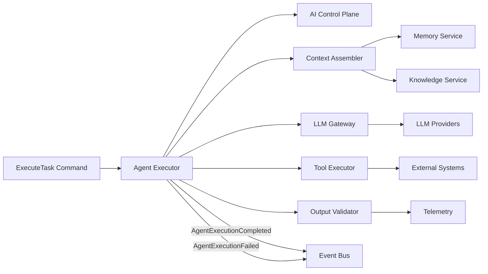

# AI Execution Plane

## Purpose

The AI Execution Plane runs agent tasks. It assembles context, retrieves knowledge and memory, routes to LLM providers, executes tools, validates outputs, and reports outcomes. It operates under the policies defined by the AI Control Plane.

## Components

| Component | Responsibility |
|---|---|
| Agent Executor | Receives tasks, loads agent version, executes steps |
| Context Assembler | Builds mission context, memory, and prompt context |
| LLM Gateway | Routes prompts to appropriate models/providers |
| Tool Executor | Executes approved tools with authorization |
| Memory Service | Retrieves conversation, mission, and agent memory |
| Knowledge Service | Retrieves domain knowledge and templates |
| Output Validator | Validates structured outputs, citations, and policy compliance |
| Telemetry Collector | Records execution metrics, tokens, latency |
| Result Publisher | Emits execution outcomes and events |

## Execution Flow

1. Execution Plane receives `ExecuteTask` command from Mission Management or Workflow Engine.
2. Fetches agent version and capabilities from Control Plane registry.
3. Queries Control Plane for policy/autonomy check.
4. If approved, assembles context and memory.
5. Selects model via LLM Gateway.
6. Sends prompt and receives response.
7. If tools are requested, validates tool authorization and executes via Tool Executor.
8. Validates output (structure, citations, policy).
9. Records outcome and telemetry.
10. Emits `AgentExecutionCompleted` or `AgentExecutionFailed` event.

## Context Assembly

Context includes:

- Mission objective and constraints
- Tenant configuration and policies
- Target company/contact research
- Conversation history
- Relevant knowledge items
- Similar past outcomes
- Tool descriptions
- Autonomy level and approval context

Context is scoped to the tenant and task; no cross-tenant data is included.

## Tool Execution

- Tools are registered in Tool Registry.
- Tool invocation requires:
  - Agent identity
  - Tenant identity
  - Mission identity
  - Execution identity
  - Authorization from Control Plane
- Tool inputs are validated.
- Tool outputs are validated.
- All tool calls are audited.
- No tool has unrestricted access; least privilege per capability.

## Output Validation

- Structured output schema validation
- Source citation presence for factual claims
- Confidence score extraction
- Policy compliance check
- Hallucination/uncertainty flagging

## Failure Handling

- LLM provider failure: retry with fallback model/provider.
- Tool failure: retry or escalate.
- Policy violation: stop execution, escalate to Control Plane.
- Low confidence: request human approval or fall back to safer action.

## Isolation

- Each execution runs within a tenant-scoped context.
- Execution workers do not share state across tenants.
- Long-running tasks are checkpointed.
- Resource limits (tokens, time, cost) are enforced per tenant/mission.

## Execution Plane Diagram

