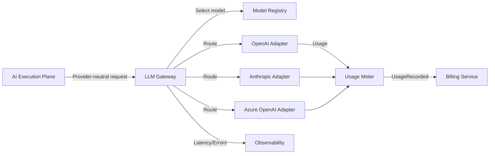

# LLM Gateway

## Purpose

The LLM Gateway abstracts the platform from specific LLM providers. It routes prompts to the most appropriate model based on capability, cost, latency, policy, and availability. It also tracks usage, enforces quotas, and supports fallback.

## Responsibilities

- Model registration and capability catalog
- Prompt routing and model selection
- Provider abstraction
- Fallback and retry
- Timeout handling
- Token and cost tracking
- Latency tracking
- Content policy filtering
- Output formatting and parsing

## Components

| Component | Responsibility |
|---|---|
| Model Registry | Stores model metadata: provider, capabilities, cost, context window, rate limits |
| Router | Selects model based on task type, capability, cost budget, and policy |
| Provider Adapter | Translates internal request/response to provider-specific APIs |
| Fallback Handler | Retries failed requests with alternative models/providers |
| Usage Meter | Tracks tokens, requests, and cost per tenant/mission/execution |
| Output Parser | Parses structured outputs and citations |
| Safety Filter | Applies content policy and moderation checks |

## Routing Criteria

| Factor | Consideration |
|---|---|
| Task capability | Does the model support reasoning, generation, classification, tool use? |
| Cost | Prefer cheaper model when confidence is high |
| Latency | Prefer faster model for time-sensitive tasks |
| Context size | Choose model with sufficient context window |
| Rate limits | Route to provider with available quota |
| Policy | Some tenants may restrict providers |
| Quality | Use stronger models for high-stakes decisions |

## Provider Abstraction

- Internal request format is provider-neutral.
- Provider adapters translate requests to OpenAI, Anthropic, Azure OpenAI, Google, or other APIs.
- Adapters normalize responses into a common structure.
- Provider-specific errors are translated into gateway errors.

## Fallback Strategy

1. Primary provider fails or rate-limited → retry with exponential backoff.
2. Persistent failure → route to secondary provider.
3. Secondary failure → queue for human review or emit failure event.
4. For critical decisions, require human confirmation if no suitable model available.

## Cost and Token Tracking

- Track input/output tokens per request.
- Aggregate cost per tenant, mission, execution, and model.
- Emit usage events to Billing & Subscription.
- Enforce per-tenant budget limits.

## Timeout and Retry

| Scenario | Timeout | Retry |
|---|---|---|
| Simple generation | 30s | 2 retries |
| Complex reasoning | 120s | 1 retry |
| Tool use | 60s | 2 retries |
| Batch processing | 300s | 1 retry |

## Security

- API keys stored in secrets manager; never in code.
- Prompts and completions are tenant-isolated in logs.
- PII filtering can be applied before logging.
- No model provider sees data from other tenants.

## Observability

- Metrics: requests/sec, latency (p50/p95/p99), token usage, error rate, fallback rate, cost per tenant.
- Traces: end-to-end prompt lifecycle with correlation IDs.
- Logs: sanitized prompts and responses.

## LLM Gateway Diagram

