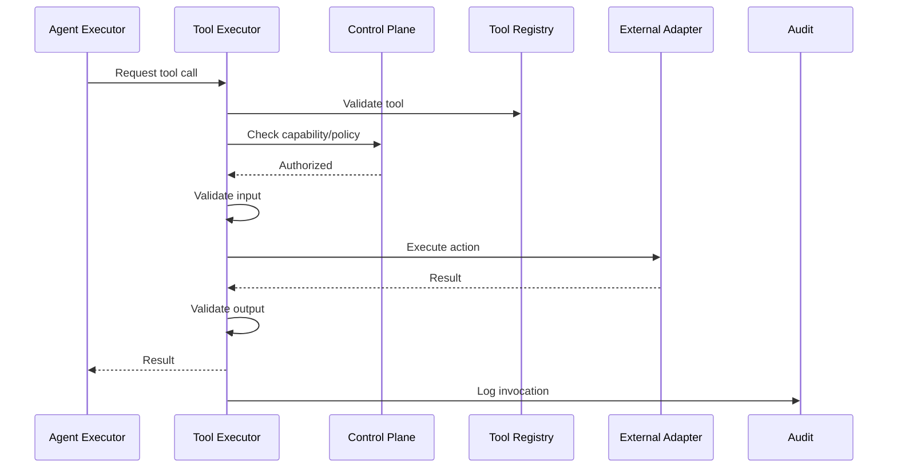

# Tool Execution Architecture

## Purpose

Tools allow agents to interact with the world (send messages, query calendars, update CRM, search the web). Tool Execution ensures that every invocation is authorized, scoped, audited, and safe.

## Tool Categories

| Category | Examples |
|---|---|
| Communication | SendEmail, SendLinkedInMessage |
| Calendar | QueryAvailability, BookMeeting, CancelMeeting |
| CRM | CreateOpportunity, UpdateOpportunity, SyncAccount |
| Research | SearchWeb, EnrichCompany, FindContacts |
| Internal | QueryKnowledge, UpdateMemory, LogDecision |
| Utility | Wait, ScheduleFollowUp, EmitEvent |

## Tool Registry

- Each tool has a name, description, input schema, output schema, required capabilities, and risk classification.
- Tools are versioned.
- Tool definitions are tenant-configurable where appropriate.

## Tool Authorization

Every tool invocation requires:

- Agent identity
- Tenant identity
- Mission identity
- Execution identity
- Required capability match
- Policy approval (autonomy level and action type)
- Input validation

## Tool Execution Flow

1. Agent requests a tool call.
2. Tool Executor validates the tool is registered.
3. Control Plane checks agent capability and policy.
4. Tool Executor validates inputs against schema.
5. Tool Executor invokes the underlying adapter (email, calendar, CRM, etc.).
6. Adapter performs external or internal action.
7. Output is validated.
8. Result is returned to agent.
9. Audit record and telemetry are emitted.

## Tool Risks

| Risk | Mitigation |
|---|---|
| Unauthorized external action | Capability and policy checks |
| Prompt injection causing unwanted tool use | Tool schema validation, allowlist, human approval for risky tools |
| Excessive calls | Rate limiting, per-mission budgets |
| Data exfiltration | No tool returns raw cross-tenant data; output validation |
| Tool poisoning | Only registered, versioned tools; tenant config review |
| Hallucinated tool inputs | Schema validation and bounds checks |

## Tool Audit

Each invocation records:

- Tool name and version
- Agent/tenant/mission/execution IDs
- Input (sanitized)
- Output summary
- Policy decision reference
- Timestamp
- Success/failure

## Tool Execution Diagram

## Tool Output Validation

- Schema validation
- Tenant isolation check
- PII detection where applicable
- No unexpected external side effects

## Tool Fallback

- If external adapter fails, retry per policy.
- For non-critical tools, execution may continue.
- For critical tools, escalate to human or abort execution.
